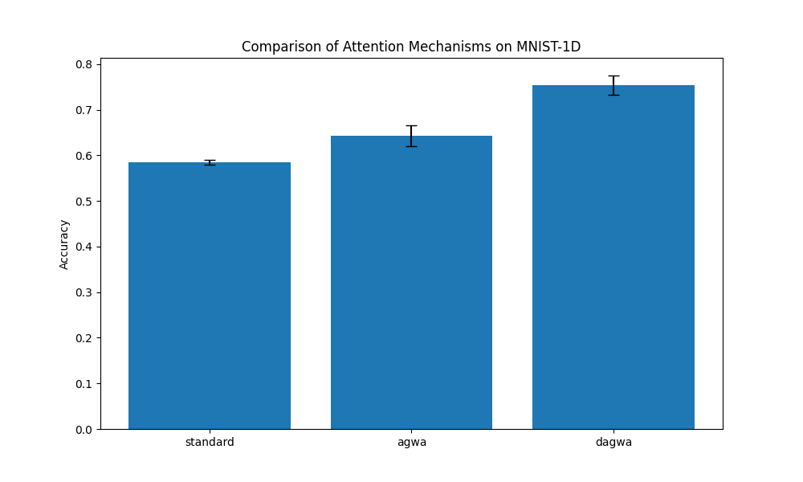

# Adaptive Gaussian Window Attention Experiment

This experiment compares standard Multi-Head Attention with Adaptive Gaussian Window Attention (AGWA) and its dynamic version (DAGWA) on the MNIST-1D dataset.

## Hypothesis
Adding a learnable Gaussian window to the attention mechanism allows each head to focus on a local context if needed. In 1D signals like MNIST-1D, local relationships are often crucial, and giving the model the ability to adaptively scale its attention window should improve performance.

## Results
| Attention Type | Mean Accuracy | Std Dev | Best LR |
|----------------|---------------|---------|---------|
| standard | 0.5844 | 0.0056 | 1.9896e-03 |
| agwa | 0.6431 | 0.0231 | 5.6713e-04 |
| dagwa | 0.7537 | 0.0212 | 8.0441e-04 |

