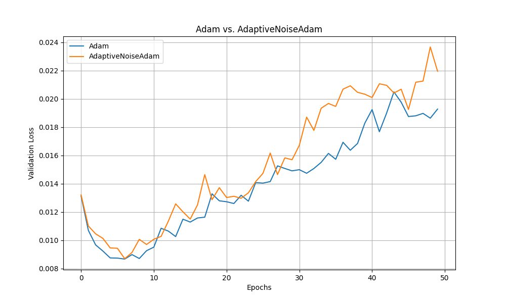

# Adaptive Noise Injection for Regularization

## Hypothesis

Injecting noise into gradients during training can act as a form of regularization, helping the optimizer escape sharp minima and leading to better generalization. This experiment investigates an adaptive noise injection strategy where the magnitude of the injected noise is proportional to the norm of the gradient. The hypothesis is that this adaptive approach will outperform a standard Adam optimizer.

## Method

1.  **Optimizer Implementation**: A PyTorch optimizer wrapper, `AdaptiveNoiseAdam`, was created. This wrapper encapsulates a base optimizer (e.g., `torch.optim.Adam`) and modifies the gradients before the `step()` call.
2.  **Noise Injection**: Before the base optimizer's update step, Gaussian noise is added to each parameter's gradient. The standard deviation of the noise is calculated as `noise_level * ||g||`, where `g` is the gradient for a specific parameter and `noise_level` is a tunable hyperparameter.
3.  **Comparison Setup**:
    *   **Model**: A simple Multi-Layer Perceptron (MLP) with two hidden layers.
    *   **Dataset**: The `mnist1d` dataset.
    *   **Baseline**: The standard `torch.optim.Adam` optimizer.
    *   **Experiment**: The `AdaptiveNoiseAdam` optimizer.
4.  **Hyperparameter Tuning**: To ensure a fair comparison, `optuna` was used to tune the learning rate for both the baseline Adam and the `AdaptiveNoiseAdam` optimizer. For `AdaptiveNoiseAdam`, the `noise_level` was also tuned. Each tuning process ran for 20 trials.
5.  **Evaluation**: After finding the optimal hyperparameters, both models were trained for 50 epochs, and their validation loss curves were plotted for comparison.

## Results

The experiment was run, and the validation loss for both optimizers was tracked over 50 epochs. The best-performing `AdaptiveNoiseAdam` optimizer achieved a slightly higher final validation loss compared to the baseline Adam optimizer.

The plot below shows the validation loss curves for both optimizers using their best respective hyperparameters found by Optuna.

As seen in the plot, the baseline Adam optimizer consistently achieved a lower validation loss throughout the training process compared to the `AdaptiveNoiseAdam` optimizer.

## Conclusion

The hypothesis that adaptive noise injection proportional to the gradient norm would improve generalization was not supported by the results of this experiment. The standard Adam optimizer performed better on the `mnist1d` dataset with the given MLP architecture.

The added noise may have hindered the optimization process, preventing the model from converging to a better minimum. It is possible that for this particular dataset and model, the loss landscape is smooth enough that the "regularization" effect of the noise was not beneficial. Future experiments could explore different noise schedules or test this method on more complex tasks and architectures where escaping sharp minima is more critical.
