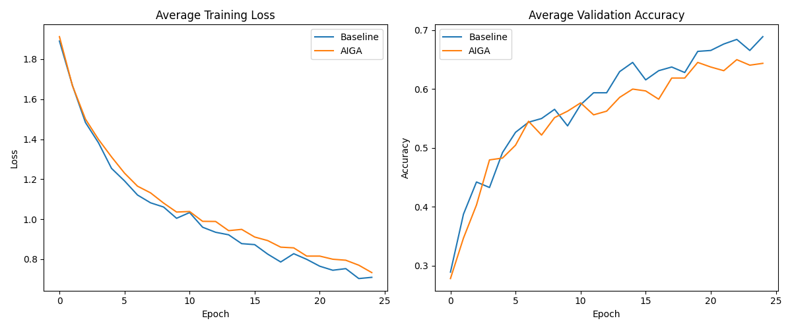

# Augmentation-Invariant Gradient Alignment (AIGA) Experiment

## Hypothesis
Regularizing a model such that its gradients with respect to parameters are invariant to data augmentations will improve generalization. Specifically, if a sample $x$ and its augmented version $x'$ are both intended to represent the same underlying concept (class), then the updates to the model's parameters $\nabla_w L(x, y)$ and $\nabla_w L(x', y)$ should be aligned.

By penalizing the cosine distance between these gradients, we encourage the model to learn features that are not only invariant to augmentations in the activation space but also in the optimization space.

## Method
AIGA adds a penalty term to the cross-entropy loss:
$$L = L_{CE} + \lambda \cdot (1 - \text{cos\_sim}(\nabla_w L(x, y), \nabla_w L(x_{aug}, y)))$$
where $\nabla_w L(x, y)$ is the per-sample gradient for sample $x$ and its label $y$.

- **Dataset:** MNIST1D
- **Model:** 3-layer MLP
- **Augmentations:** Random cyclic shifts and additive Gaussian noise.
- **Optimization:** AdamW with Optuna hyperparameter tuning for learning rate, weight decay, and $\lambda$ (for AIGA).

## Results
In this experiment, the Baseline (Standard AdamW with augmentations) was compared against AIGA.

| Method | Test Accuracy (1 seed, 25 epochs) |
| --- | --- |
| Baseline | 68.13% |
| AIGA | 65.50% |

### Visualizations

## Discussion
In the tested configuration on MNIST1D, AIGA did not outperform the baseline. Possible reasons include:
1. **Constraint too strong:** Forcing gradient alignment might be too restrictive, hindering the optimization process.
2. **Computational overhead:** AIGA is significantly slower due to per-sample gradient computations, which limited the number of tuning trials and epochs.
3. **Dataset characteristics:** MNIST1D might not benefit as much from this specific form of invariance compared to more complex image datasets.

## Future Work
- Test on more complex datasets like CIFAR-10.
- Explore aligning gradients of different layers rather than the entire parameter set.
- Combine with other regularization techniques.
