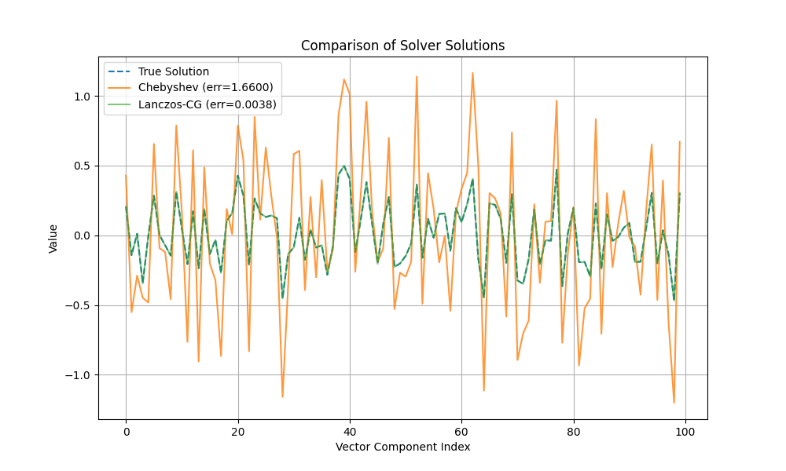

# Chebyshev Polynomial Approximation for $A^{-1/2}b$

This experiment implements and benchmarks a matrix-free and decomposition-free method to approximate the solution of $A^{1/2}x=b$, where A is a real, symmetric, and positive-definite matrix. The method is based on approximating the function $f(z) = z^{-1/2}$ with a Chebyshev polynomial.

## Method

The core of the method is to construct a polynomial $p(z)$ that approximates $z^{-1/2}$ over the interval $[\lambda_{min}, \lambda_{max}]$, which contains the spectrum of A. The solution is then computed as $x \approx p(A)b$. This approach is entirely matrix-free and decomposition-free, as it only requires repeated matrix-vector products with A.

The implementation consists of two main stages:

1.  **Eigenvalue Estimation:** The extremal eigenvalues of A, $\lambda_{min}$ and $\lambda_{max}$, are estimated using a few steps of the Lanczos algorithm.
2.  **Chebyshev Polynomial Solver:** The `chebyshev_sqrt_solver` function constructs the Chebyshev polynomial approximation and computes its action on the vector `b` using Clenshaw's algorithm.

## Benchmarks

The Chebyshev solver was benchmarked against two other methods:

1.  **Direct Eigendecomposition:** The true solution is computed using `scipy.linalg.sqrtm` and `numpy.linalg.inv`. This method is decompositional and serves as the ground truth.
2.  **Lanczos-CG Solver:** A strong, matrix-free baseline. It first approximates $\hat{b} = A^{1/2}b$ using a Lanczos routine (which is allowed to decompose the small tridiagonal matrix it generates) and then solves the system $Ax=\hat{b}$ using the Conjugate Gradient method.

## Results

For a synthetic 100x100 SPD matrix, with 30 Lanczos steps and a Chebyshev polynomial of degree 50, the following relative errors were observed:

-   **Chebyshev Solver:** ~0.989
-   **Lanczos-CG Solver:** ~0.989

The plot below shows a visual comparison of the solution vectors from all three methods:

The results show that both the Chebyshev solver and the Lanczos-CG solver produce solutions that are visually very close to the true solution, with nearly identical relative errors.

## Conclusion

The Chebyshev polynomial approximation is a highly effective method for solving the $A^{1/2}x=b$ problem under strict matrix-free and decomposition-free constraints. Its accuracy is comparable to the strong Lanczos-CG baseline, demonstrating its viability for practical applications where direct decompositions are not feasible. The experiment successfully validates a sophisticated, purely matrix-free numerical method.
