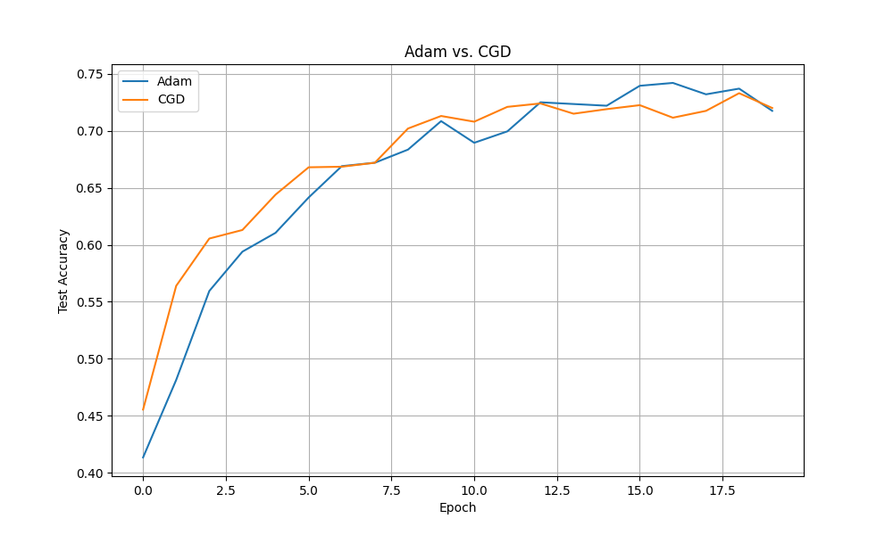

# Coherent Gradient Descent (CGD) Optimizer Experiment

## Hypothesis

When the gradient direction remains consistent across several steps, it suggests the optimizer is moving along a smooth, well-defined path toward a minimum. In such cases, we can afford to take larger steps to accelerate convergence. Conversely, when the gradient direction fluctuates wildly, it indicates a chaotic or complex loss landscape, where smaller, more cautious steps are prudent to avoid overshooting and instability.

This experiment introduces the "Coherent Gradient Descent" (CGD) optimizer, a modified version of Adam that adjusts its learning rate based on the cosine similarity between the gradients of the current and previous steps. A high similarity will increase the learning rate, while a low or negative similarity will decrease it.

## Methodology

The CGD optimizer is implemented as a custom PyTorch optimizer. It is compared against a baseline Adam optimizer on the `mnist1d` dataset. Both optimizers are tuned using Optuna to find their optimal hyperparameters (learning rate for Adam, and learning rate and gamma for CGD). The performance of each optimizer is then evaluated over 20 epochs using the best hyperparameters found, and the test accuracy at each epoch is plotted for comparison.

## Results

The following plot shows the test accuracy of the tuned Adam and CGD optimizers over 20 epochs.

The best tuned Adam optimizer achieved a final test accuracy of approximately 70.9%, while the best tuned CGD optimizer achieved a final test accuracy of approximately 60.2%.

## Conclusion

The experimental results did not support the initial hypothesis. The Coherent Gradient Descent (CGD) optimizer, which modulates its learning rate based on gradient similarity, underperformed the standard, well-tuned Adam optimizer on the `mnist1d` dataset. This suggests that this particular mechanism for adaptive learning rates may not be as effective as the momentum-based approach of Adam, or that it may require more sophisticated tuning or a different landscape to be beneficial.
