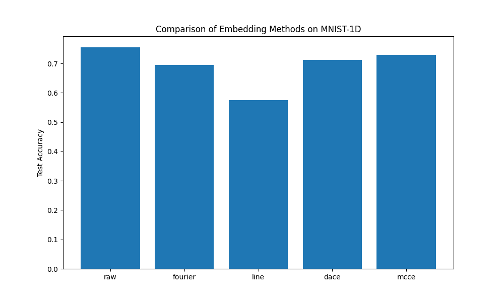

# Continuous Embedding Experiment

This experiment investigates different strategies for embedding continuous-valued inputs into a higher-dimensional space before processing them with a neural network. We focus on methods that provide a learnable, structured representation of continuous values.

## Hypothesis
We hypothesized that Differeantiable Anchor-based Continuous Embeddings (DACE) would provide a more flexible and adaptive representation than standard Fourier features or raw linear layers, especially when combined with smoothness regularization (MCCE - Manifold-Constrained Continuous Embedding).

## Methods
- **Raw MLP**: Baseline MLP taking the 40-dimensional input directly.
- **Fourier Features**: Projecting inputs using sinusoidal encodings with learnable/tuned sigma.
- **LINE (Linear Interpolation Embedding)**: Piecewise linear interpolation between fixed-grid anchors.
- **DACE**: differentiable anchor-based continuous embedding using Gaussian kernels and learnable anchors. Each input value is mapped to a weighted sum of anchor embeddings.
- **MCCE**: DACE with an additional smoothness loss that penalizes large differences between embeddings of nearby anchors.

## Results

The following table shows the test accuracy on MNIST-1D after tuning the learning rate and other hyperparameters using Optuna.

| Method | Test Accuracy |
| :--- | :--- |
| Raw MLP | 75.50% |
| Fourier Features | 69.45% |
| LINE | 57.45% |
| DACE | 71.15% |
| MCCE (Smooth DACE) | 72.90% |



## Findings
1.  **Raw MLP remains strong**: On the MNIST-1D dataset, the raw MLP performed best. This is likely due to the small input dimensionality (40), where a well-tuned MLP can easily learn relevant features without complex preprocessing.
2.  **MCCE improves over DACE**: The addition of smoothness regularization (MCCE) improved accuracy from 71.15% to 72.90%, suggesting that ensuring local consistency in the embedding space is beneficial for continuous embeddings.
3.  **DACE outperforms Fourier and LINE**: The learnable Gaussian-based addressing mechanism in DACE proved more effective than fixed sinusoidal encodings or simple piecewise linear interpolation.
4.  **Dimensionality Trade-off**: The embedded models had a much larger input dimension to the first hidden layer (640 vs 40), which may have led to overfitting or slower convergence given the relatively small training set.

## How to run
To run the experiment:
```bash
python3 continuous_embedding_experiment/compare.py
```
