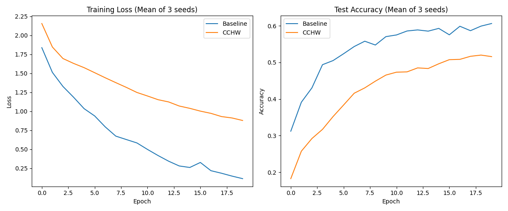

# Cross-Class Helpfulness Weighting (CCHW)

This experiment investigates whether weighting training samples based on the alignment of their gradients with the average gradients of other classes (excluding their own) can improve generalization.

## Hypothesis

Weighting samples based on their "Cross-Class Helpfulness" (CCH) can influence the learning of shared vs. class-specific features.
- A **positive beta** emphasizes samples whose gradients align with the consensus of other classes, potentially favoring shared feature learning.
- A **negative beta** emphasizes samples whose gradients conflict with other classes, potentially focusing the model on discriminative, class-specific features.

## Methodology

- **Dataset**: MNIST-1D (4,000 samples)
- **Model**: 3-layer MLP (256 hidden units)
- **Training**: AdamW optimizer with tuned learning rate.
- **CCHW Logic**:
    1. Compute per-sample gradients $g_i$ using `torch.func.vmap`.
    2. Compute class-average gradients $\bar{g}_c$ for each class in the batch.
    3. Compute helpfulness $h_i = \text{mean}_{c \neq y_i} \cos(g_i, \bar{g}_c)$.
    4. Weight each sample by $w_i = \exp(\beta \cdot h_i)$ (normalized to mean 1.0).
    5. Update parameters using the weighted average gradient.

## Results

We compared tuned Baseline (AdamW) with tuned CCHW.

| Method | Best Params | Test Accuracy (3 seeds) |
|--------|-------------|-------------------------|
| Baseline | LR: 0.0095 | 60.6% ± 0.7% |
| CCHW | LR: 0.0006, $\beta$: -1.61 | 51.6% ± 0.7% |

## Analysis

In our experiments on MNIST-1D:
1. **CCHW underperformed the baseline.** The baseline achieved significantly higher accuracy and faster convergence.
2. **Preference for Negative Beta**: The tuning process favored a negative $\beta$ (-1.61), suggesting that the model benefited more (or suffered less) from emphasizing samples that conflict with other classes.
3. **Slow Convergence**: CCHW showed much slower loss reduction and accuracy improvement. This is likely because the weighting scheme introduces additional noise or specifically downweights the most consistent gradient directions (the consensus).

## Conclusion

While the concept of cross-class alignment is theoretically interesting, the current implementation of CCHW as a global gradient weighting scheme does not appear to provide a benefit over a well-tuned AdamW baseline for the MNIST-1D task. Future work could explore applying this weighting specifically to the feature-learning layers (encoder) while leaving the classifier head with standard updates.
