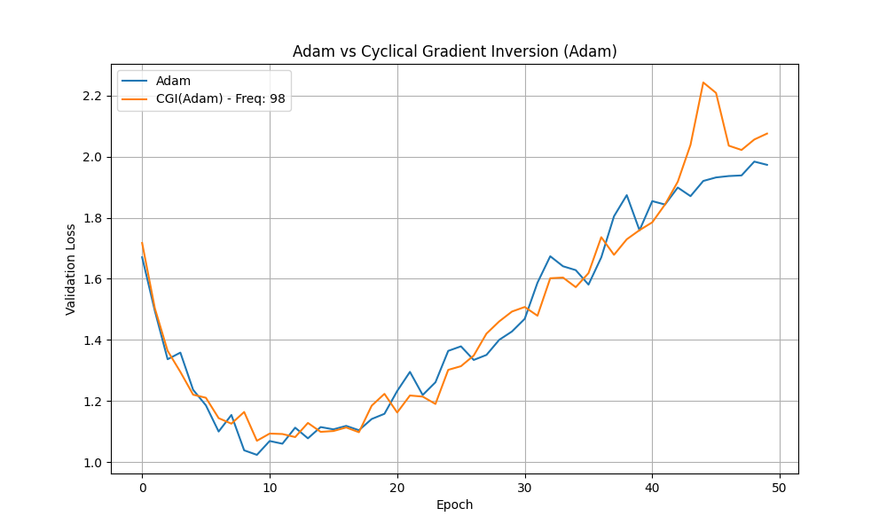

# Cyclical Gradient Inversion Experiment

This experiment investigates a novel optimization technique called Cyclical Gradient Inversion (CGI).

## Hypothesis

Periodically inverting the gradient during training can help the model escape sharp local minima and explore the loss landscape more effectively, ultimately leading to a better final solution. The inversion is controlled by a cyclical schedule.

## Methodology

1.  **Optimizer:** A new optimizer, `CyclicalGradientInversion`, was created. It wraps a base optimizer (Adam in this case) and inverts the gradients at a specified `inversion_frequency`.

2.  **Dataset:** The `mnist1d` dataset was used for this experiment.

3.  **Model:** A simple Multi-Layer Perceptron (MLP) was used as the model.

4.  **Comparison:** The performance of `CGI(Adam)` was compared against a standard `Adam` optimizer.

5.  **Hyperparameter Tuning:** To ensure a fair comparison, `optuna` was used to tune the learning rate for both optimizers, as well as the `inversion_frequency` for `CGI(Adam)`. The following search spaces were used:
    *   `learning_rate`: 1e-5 to 1e-1 (log scale)
    *   `inversion_frequency`: 2 to 100

## Results

After running the hyperparameter tuning, the best parameters were found to be:

*   **Adam:** `lr = 0.0057`
*   **CGI(Adam):** `lr = 0.0053`, `inversion_frequency = 98`

These parameters were then used to train the models for 50 epochs. The validation loss curves are shown below:

## Conclusion

The results show that the Adam and CGI(Adam) optimizers perform nearly identically on the `mnist1d` dataset. The small variations in their validation loss curves are likely due to random initialization and data shuffling rather than any significant difference in their optimization capabilities.

Therefore, the initial hypothesis that cyclical gradient inversion can help escape local minima and find a better solution is not supported by this experiment. It is possible that the `mnist1d` dataset is not complex enough to benefit from this technique, or that the inversion frequency needs to be scheduled in a more sophisticated way.
