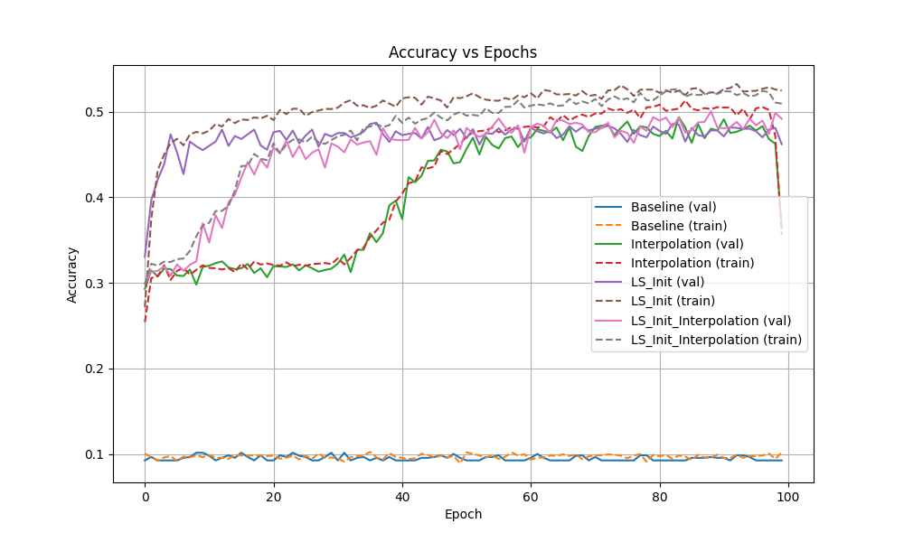
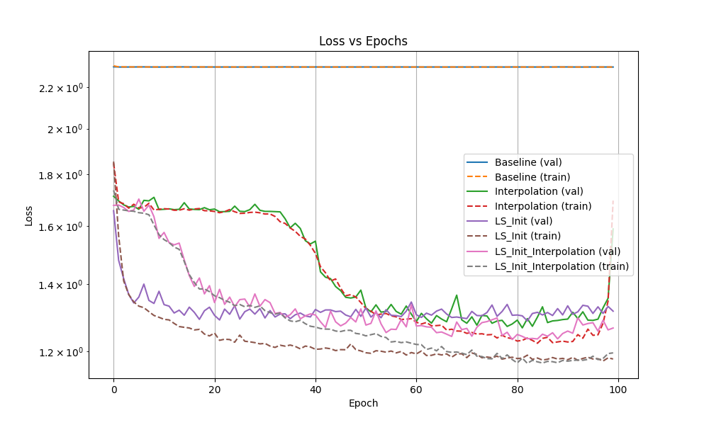

# Experiment: Deep Linear Initialization and Activation Interpolation for Long and Thin Networks

## Hypothesis
Training "long and thin" neural networks is notoriously difficult due to vanishing/exploding gradients and the narrow bottleneck in each layer. We hypothesize that:
1. Initializing the network to the Least Squares (LS) solution of the linear part of the problem provides a better starting point than standard random initialization.
2. Slowly interpolating the activation function from identity to ReLU (Identity $\to$ ReLU) helps the network maintain a healthy signal flow early in training while gradually introducing non-linearity.
3. Combining both techniques will outperform either technique alone and significantly outperform standard training.

## Methodology
- **Dataset**: MNIST-1D (40 input features, 10 output classes).
- **Architecture**: A 16-layer MLP with a hidden width of 10.
- **Least Squares Initialization**:
    - Compute the LS solution $W_{LS}, b_{LS}$ for $Y = XW + b$.
    - Decompose $W_{LS}^T$ using SVD: $W_{LS}^T = U S V^T$.
    - Initialize the weights of the 16 layers such that their product equals $W_{LS}^T$. Specifically, $W_1 = V^T$, $W_2 = S$, $W_3 \dots W_{15} = I$, and $W_{16} = U$, with $b_{16} = b_{LS}$.
- **Activation Interpolation**:
    - Use activation $\sigma_\alpha(x) = (1-\alpha)x + \alpha \text{ReLU}(x)$.
    - $\alpha$ linearly increases from $0.0$ to $1.0$ over 100 epochs.
- **Baselines**:
    - **Baseline**: Kaiming initialization and standard ReLU ($\alpha=1$).
    - **Interpolation Only**: Kaiming initialization and activation interpolation.
    - **LS Init Only**: LS initialization and standard ReLU.
    - **LS Init + Interpolation**: Both LS initialization and activation interpolation.
- **Hyperparameter Tuning**: Learning rate was tuned for each configuration using Optuna (5 trials per config).

## Results

| Configuration | Best Val Acc | Final Val Acc |
|---------------|--------------|---------------|
| Baseline      | 0.1015       | 0.0925        |
| Interpolation | 0.4935       | 0.3645        |
| LS Init       | 0.4870       | 0.4620        |
| **LS Init + Interpolation** | **0.5005** | **0.4915** |

### Accuracy vs Epochs

### Loss vs Epochs

## Analysis
1. **Baseline Failure**: The standard Baseline (Kaiming + ReLU) completely failed to train, staying around 10% accuracy (random chance). This confirms that a 16-layer network with width 10 is extremely difficult to train with standard methods.
2. **Success of LS Init**: Initializing to the LS solution immediately boosted performance to ~48% accuracy. Even with standard ReLU, the network was able to learn further or at least maintain the LS performance.
3. **Success of Interpolation**: Starting with identity activations allowed the Kaiming-initialized network to escape the "dead" region and reach ~49% accuracy. However, its performance was less stable than the LS-initialized versions, showing a significant drop as $\alpha \to 1$.
4. **Combined Effect**: The combination of LS initialization and activation interpolation was the most effective and stable, achieving the highest validation accuracy and maintaining it through the end of training.

## Conclusion
Initializing deep, thin networks to a linear least-squares solution and gradually introducing non-linearity via activation interpolation is a highly effective strategy for training architectures that otherwise fail to converge. LS initialization provides a strong linear baseline, while interpolation ensures that the network remains trainable as it transitions from a linear to a non-linear regime.
