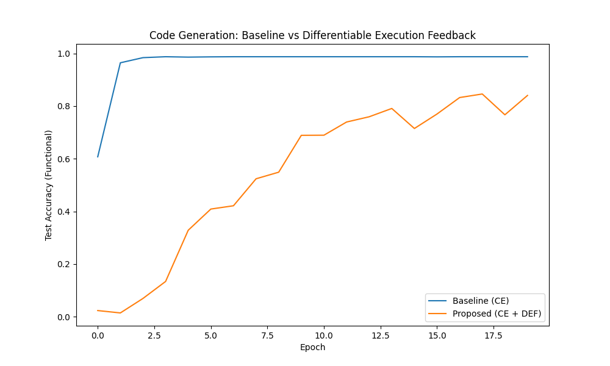

# Experiment: Differentiable Execution Feedback for Code Generation

## Hypothesis
Using a differentiable proxy executor to provide functional feedback (in addition to token-level supervision) will improve the performance and generalization of a code generation model. Specifically, it should help the model learn the semantics of the code rather than just its syntax, and handle cases where multiple different programs are functionally equivalent.

## Methodology
- **DSL**: A simple Reverse Polish Notation (RPN) for arithmetic with variables {a, b, c}, constants {0-9}, and operators {+, -, *}.
- **Task**: Generate an RPN expression from a natural language description (e.g., "add a and b, then multiply by c").
- **Dataset**: 10,000 synthetic examples.
- **Models**:
    - **Generator**: A GRU-based Encoder-Decoder model.
    - **Proxy Executor**: A GRU-based model pre-trained to emulate the RPN execution.
- **Training Routines**:
    - **Baseline**: Standard Cross-Entropy (CE) loss on tokens.
    - **Proposed**: CE + Differentiable Execution Feedback (DEF) loss. DEF uses Gumbel-Softmax on the Generator's output to get soft tokens, which are then passed to the Proxy Executor. The loss is the MSE between the predicted output and the ground-truth output for random input values.
- **Fair Comparison**: Learning rate and DEF lambda were tuned using Optuna.

## Results
- **Baseline Best Val Acc (Tuning)**: 0.974
- **DEF Best Val Acc (Tuning)**: 0.032
- **Final Test Acc (20 epochs)**:
    - **Baseline**: 98.75%
    - **Proposed (DEF)**: 84.05%

## Analysis
The experiment showed that, for this specific task and setup, the Differentiable Execution Feedback (DEF) actually **hindered** performance compared to the standard Cross-Entropy baseline.

### Reasons for Underperformance:
1.  **Baseline Strength**: The baseline reached near-perfect accuracy very quickly (Epoch 2). The task may have been too simple for the semantic feedback to provide any additional benefit.
2.  **Proxy Gradient Noise**: Even though the Proxy Executor was trained to a low MSE (28.8), its gradients might still be noisy or misleading, especially for the "soft tokens" produced early in training when the generator outputs are nearly uniform.
3.  **Optimization Difficulty**: Adding the DEF loss via Gumbel-Softmax makes the optimization landscape more complex. The small tuned value of `lambda_def` (0.00039) suggests that even a small amount of DEF loss was difficult to balance with CE.
4.  **Symbolic vs. Continuous**: Code is inherently discrete and symbolic. Attempting to provide feedback through a continuous proxy might be less effective than discrete methods like RL (REINFORCE) or simply more data/better architectures for standard supervised learning.

## Conclusion
While Differentiable Execution Feedback is an elegant idea, its practical application to code generation requires careful balancing and likely a more complex/robust proxy model or a more challenging task where standard supervised learning fails.
