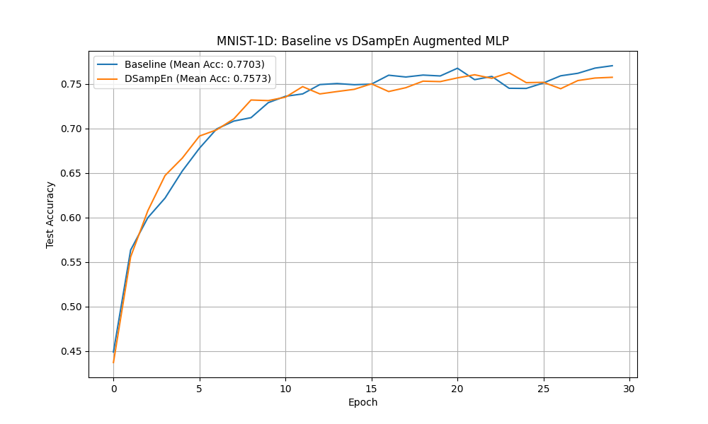

# Differentiable Sample Entropy (DSampEn) Experiment

## Hypothesis
Sample Entropy (SampEn) is a robust measure of time-series complexity, quantifying the regularity and unpredictability of a signal. Standard SampEn is non-differentiable due to its use of Heaviside step functions for counting subsequence matches. We hypothesize that a **Differentiable Sample Entropy (DSampEn)** layer, using a sigmoid-based soft-counting mechanism, can provide a learnable complexity feature that improves signal classification performance.

## Methodology

### DSampEn Layer
The layer approximates Sample Entropy by:
1.  Extracting all subsequences (windows) of length $m$ and $m+1$.
2.  Computing pairwise $L_2$ distances between windows.
3.  Applying a soft-thresholding function $\sigma(\gamma(r - d))$ to count matches, where $r$ is a threshold and $\gamma$ is a temperature parameter (both learnable).
4.  Computing the negative log-ratio of matches of length $m+1$ to matches of length $m$:
    $$ \text{DSampEn} = -\log\left(\frac{A}{B}\right) = \log(B) - \log(A) $$
    where $A$ and $B$ are the sums of soft-matches for lengths $m+1$ and $m$ respectively.

### Experimental Setup
- **Dataset**: MNIST-1D (10,000 samples).
- **Models**:
  - `BaselineMLP`: 2-layer MLP (256 units).
  - `DSampEnAugmentedMLP`: Same MLP with one additional input feature (DSampEn).
- **Hyperparameter Tuning**: Learning rates were tuned for both models using Optuna (10 trials each).
- **Evaluation**: 3 random seeds for 30 epochs each.

## Results

| Model | Mean Accuracy | Std Dev | Best LR |
| :--- | :---: | :---: | :---: |
| **Baseline MLP** | **77.03%** | 0.94% | 0.00354 |
| **DSampEn Augmented MLP** | 75.73% | 0.97% | 0.0134 |

## Observations
- **Performance**: The DSampEn augmented model did not outperform the baseline MLP. In fact, it achieved slightly lower accuracy.
- **Inductive Bias**: While SampEn is a powerful feature for long, noisy signals, it may be less effective for the short (length 40) and relatively structured signals in MNIST-1D. The information captured by SampEn might already be easily extracted by the first layer of the MLP.
- **Optimization**: The augmented model required a significantly higher learning rate (0.0134 vs 0.00354) during tuning, suggesting that the DSampEn layer might introduce more complexity or non-linearity to the loss landscape, even though it is differentiable.

## Conclusion
The Differentiable Sample Entropy layer successfully provides a trainable approximation of signal complexity. However, for the MNIST-1D dataset, this added feature does not provide a discriminative advantage over a standard MLP. Future work could evaluate this layer on longer time-series datasets or tasks where signal regularity is a primary class-discriminative feature (e.g., heart rate variability analysis).
