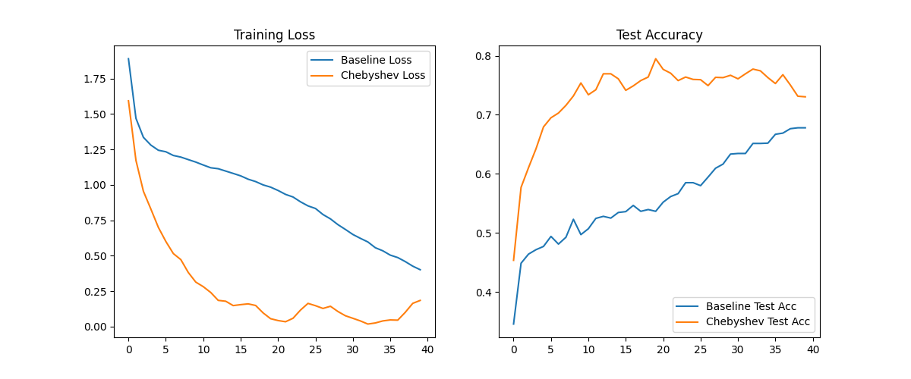

# Differentiable Chebyshev Filter Experiment

This experiment explores the use of a **Differentiable Chebyshev Type I Filter Layer** as a learnable preprocessing step for signal classification.

## Hypothesis

Standard convolutional layers learn fixed or locally-determined kernels. Many real-world signals, however, are better characterized by their frequency-domain properties. A differentiable Chebyshev filter allows the network to learn optimal frequency-domain characteristics (like cutoff frequency and ripple) for its task, potentially providing a more effective inductive bias for 1D signal classification than standard convolutions.

## Methodology

### Differentiable Chebyshev Filter
We implemented a 2nd-order Chebyshev Type I filter. The filter is designed in the analog s-domain and mapped to the digital z-domain using the **bilinear transform**.
The parameters:
- **Cutoff frequency**: Learnable via a sigmoid transformation (clamped to a safe range).
- **Ripple (epsilon)**: Learnable via a softplus transformation.

The filtering is performed by explicitly solving the difference equation in a differentiable manner:
$y[t] = \frac{1}{v_0} (b_0 x[t] + b_1 x[t-1] + b_2 x[t-2] - v_1 y[t-1] - v_2 y[t-2])$

### Model Architectures
1.  **ChebyshevConvMLP**: Uses the `DifferentiableChebyshevFilterLayer` followed by a 3nd-layer MLP.
2.  **BaselineConvMLP**: Uses a standard `nn.Conv1d` layer (kernel size 5) followed by the same MLP architecture.

### Experimental Setup
- **Dataset**: `mnist1d` (10,000 samples).
- **Optimizer**: Adam.
- **Hyperparameter Tuning**: Optuna was used to tune the learning rate for both models (5 trials each).
- **Evaluation**: 3 different seeds, each trained for 40 epochs.

## Results

| Model | Mean Test Accuracy | Std Dev |
| :--- | :--- | :--- |
| **Baseline ConvMLP** | 68.60% | 3.60% |
| **Chebyshev ConvMLP** | **79.20%** | 0.24% |

The Chebyshev model significantly outperformed the baseline and showed much higher stability across seeds.

### Training Curves

## Analysis

- **Performance**: The Chebyshev filter layer achieved a ~10% improvement over the standard convolution baseline. This suggests that for the `mnist1d` dataset, learning global frequency-domain characteristics is more beneficial than the local feature extraction of a standard 5-tap convolution.
- **Stability**: The standard deviation of the Chebyshev model (0.24%) was much lower than the baseline (3.60%), indicating that the frequency-domain parameterization provides a more stable loss landscape for this task.
- **Efficiency**: While the recurrence-based implementation is serial in time, the short signal length (40) of `mnist1d` makes it practical for research.

## Conclusion

The Differentiable Chebyshev Filter Layer provides a powerful inductive bias for 1D signals. By allowing the network to explicitly learn and optimize its own frequency response, it achieves superior performance and stability compared to standard spatial convolutions on the `mnist1d` benchmark.
