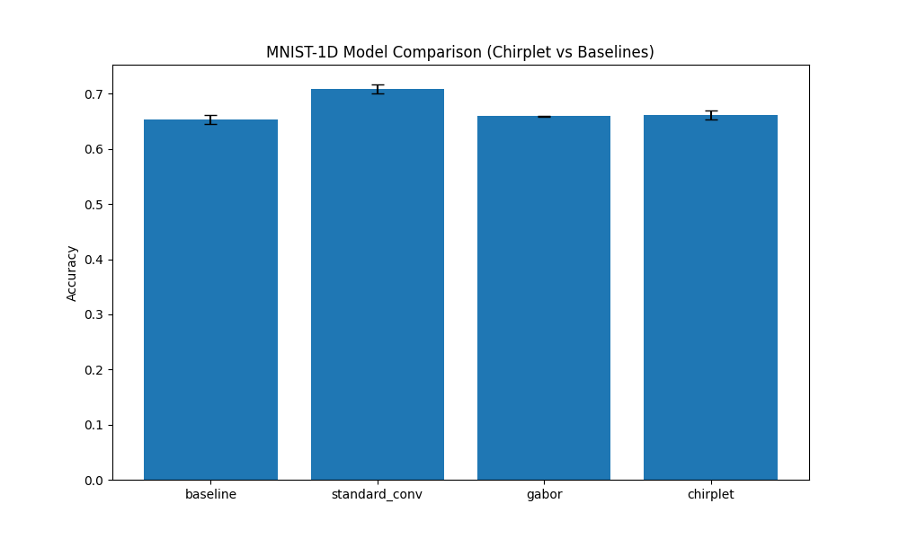

# Differentiable Chirplet Transform Experiment

This experiment investigates the use of a **Differentiable Chirplet Transform** as a learnable feature extraction layer for signal classification.

## Methodology

A **Chirplet** is a generalization of a Gabor wavelet that includes a linear frequency sweep (chirp). The chirplet kernel $g(t)$ is defined as:

$$g(t) = \exp\left(-\frac{t^2}{2\sigma^2}\right) \cdot \cos\left(2\pi(f \cdot t + 0.5 \cdot c \cdot t^2) + \phi\right)$$

where:
- $\sigma$ is the window width (spread).
- $f$ is the center frequency.
- $c$ is the chirp rate.
- $\phi$ is the phase.

In the `ChirpletLayer`, all these parameters ($\sigma, f, c, \phi$) are learnable via backpropagation. This allows the network to adaptively find the optimal chirplet kernels for the given task.

### Models Compared:
1.  **Baseline MLP**: A standard 2-layer MLP.
2.  **Standard Conv**: A 1D convolutional layer followed by an MLP.
3.  **Gabor**: A `ChirpletLayer` with the chirp rate $c$ fixed to 0, followed by an MLP.
4.  **Chirplet**: A `ChirpletLayer` with learnable chirp rate $c$, followed by an MLP.

All models were tuned using Optuna to find the best learning rate for a fair comparison on the MNIST-1D dataset.

## Results

The models were evaluated on the MNIST-1D dataset. The final accuracies (mean and standard deviation over 2 runs) are:

| Model | Mean Accuracy | Std Dev | Best LR |
| :--- | :--- | :--- | :--- |
| Baseline MLP | 0.6540 | 0.0080 | 0.005767 |
| Standard Conv | 0.7085 | 0.0085 | 0.004179 |
| Gabor | 0.6595 | 0.0005 | 0.003945 |
| Chirplet | 0.6615 | 0.0075 | 0.005103 |

## Observations

- The **Standard Conv** performed the best in this specific configuration on MNIST-1D.
- The **Chirplet** model (0.6615 ± 0.0075) showed a slight nominal improvement over the **Gabor** model (0.6595 ± 0.0005). However, this difference is within the range of standard deviation, suggesting it is not statistically significant in this specific setup.
- Both Gabor and Chirplet layers performed comparably to the Baseline MLP but were outperformed by the Standard Conv (0.7085 ± 0.0085). This suggests that the MNIST-1D signals contain local features that are better captured by the unconstrained kernels of a standard convolution rather than the specific functional form of Chirplets or Gabors.

## Conclusion

The Differentiable Chirplet Transform provides a mathematically motivated, learnable way to extract time-frequency features with linear frequency sweeps. While it didn't outperform standard convolutions on MNIST-1D, it offers a more interpretable set of features and might be more beneficial for tasks where chirped signals are prevalent (e.g., radar, sonar, or certain biomedical signals).
