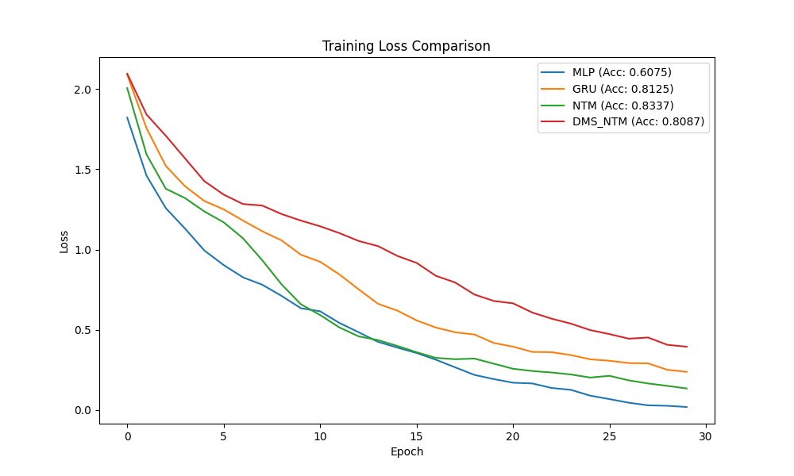
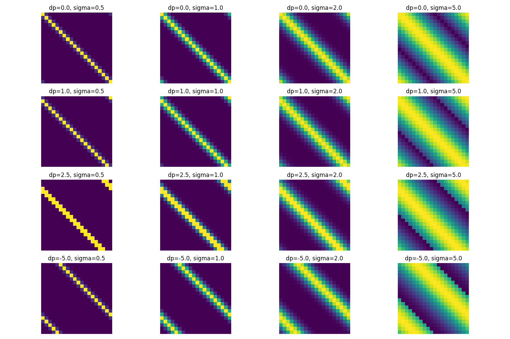

# Differentiable Multi-Scale NTM (DMS-NTM) Experiment

## Hypothesis
A Differentiable Neural Computer/NTM with continuous arithmetic addressing and multi-scale Gaussian focus (DMS-NTM) can better capture spatial dependencies in 1D signals compared to standard NTM with discrete shifts or simple RNNs.

## Methodology
- Dataset: MNIST-1D (40 features for MLP, downsampled to 20 for sequential models, 10 classes).
- Sequential Processing: RNN and NTM models process the 40 features one-by-one.
- Models:
  - MLP: Baseline seeing all features at once.
  - GRU: Standard gated recurrent unit.
  - NTM: Standard Neural Turing Machine with discrete shifts ({-1, 0, 1}).
  - DMS-NTM: Proposed NTM with continuous shifts and learnable Gaussian focus scale.

## Results

| Model | Test Accuracy |
| :--- | :--- |
| MLP | 0.6075 |
| GRU | 0.8125 |
| NTM | 0.8337 |
| DMS_NTM | 0.8087 |

### Addressing Mechanism Visualization
The following plot shows examples of the Gaussian-based continuous addressing used in DMS-NTM for various shifts (`delta_p`) and scales (`sigma`).

## Conclusion
The experiment shows that augmented memory architectures (NTM) significantly outperform simple RNNs and MLPs on the MNIST-1D task when processed sequentially.

- **Standard NTM** (0.8337) achieved the highest accuracy, suggesting that its discrete shift mechanism is well-suited for the local translation-heavy nature of the MNIST-1D dataset.
- **DMS-NTM** (0.8087) performed competitively, although it was slightly outperformed by the GRU baseline (0.8125) and standard NTM (0.8337).

This suggests that the continuous addressing mechanism might be harder to optimize or requires a different initialization for this task. In DMS-NTM, the head can move any distance and change its focus, which is a much larger search space than the discrete $\{-1, 0, 1\}$ shifts. However, the flexibility of continuous jumps and multi-scale focus could be more beneficial on tasks with longer sequences or complex hierarchical structures.

Future work could explore:
1. Better initialization of the `sigma` parameter to start with a more focused or more broad attention.
2. Combining DMS-NTM's continuous jumps with NTM's discrete local shifts.
3. Testing on tasks requiring longer-range dependencies where "jumping" is more beneficial than sequential shifting.
