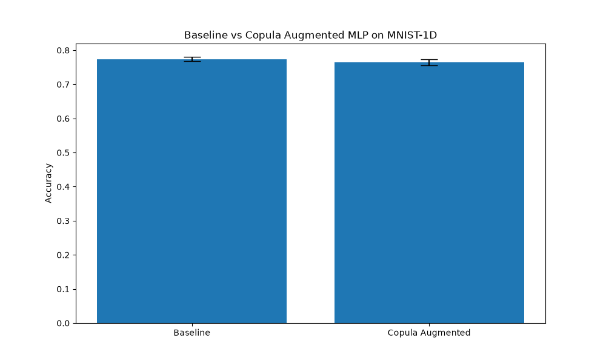

# Differentiable Copula Transformation Experiment

## Hypothesis
The hypothesis is that augmenting a neural network with a differentiable copula transformation layer can improve its performance on signal classification tasks by providing a more normalized and structured representation of the input features. Specifically, mapping marginal distributions to a standard normal distribution (Gaussianizing) or a uniform distribution can help the network handle non-gaussian or skewed distributions more effectively.

## Methodology
1.  **Differentiable Copula Layer**: We implemented a layer that computes a soft empirical CDF of the input features using sigmoids. This allows gradients to flow through the rank-based transformation.
    -   The layer can output either uniform margins [0, 1] or Gaussian margins (using an inverse Gaussian CDF approximation).
    -   The "steepness" of the soft rank (alpha) is a learnable parameter per feature.
2.  **Model Architectures**:
    -   `BaselineMLP`: A standard MLP with two hidden layers.
    -   `CopulaAugmentedMLP`: The same MLP architecture, but the input is concatenated with its copula-transformed version.
3.  **Dataset**: MNIST-1D, a 1D version of the MNIST dataset, with 10,000 samples.
4.  **Evaluation**:
    -   Both models were tuned using Optuna for their learning rates (10 trials each).
    -   The best learning rates were used to train both models for 5 independent runs (50 epochs each).
    -   Mean accuracy and standard deviation were recorded.

## Results
The experiment results are as follows:

| Model | Accuracy (Mean +/- Std) |
| :--- | :--- |
| **Baseline MLP** | 0.7739 +/- 0.0066 |
| **Copula Augmented MLP** | 0.7647 +/- 0.0085 |

The `results.txt` file contains the specific best learning rates found:
- Best LR Baseline: 0.00352759249504898
- Best LR Copula: 0.008535537645115828

## Conclusion
In this experiment on the MNIST-1D dataset, the Copula Augmented MLP did not outperform the Baseline MLP. In fact, it performed slightly worse on average. This suggests that for this specific dataset, the raw features are already well-represented for a standard MLP, and the additional complexity of the copula transformation (which effectively doubles the input dimension and introduces a complex non-linear transformation) did not provide a generalization benefit. It's possible that on tabular datasets with more skewed or non-standard distributions, this approach might be more beneficial.

