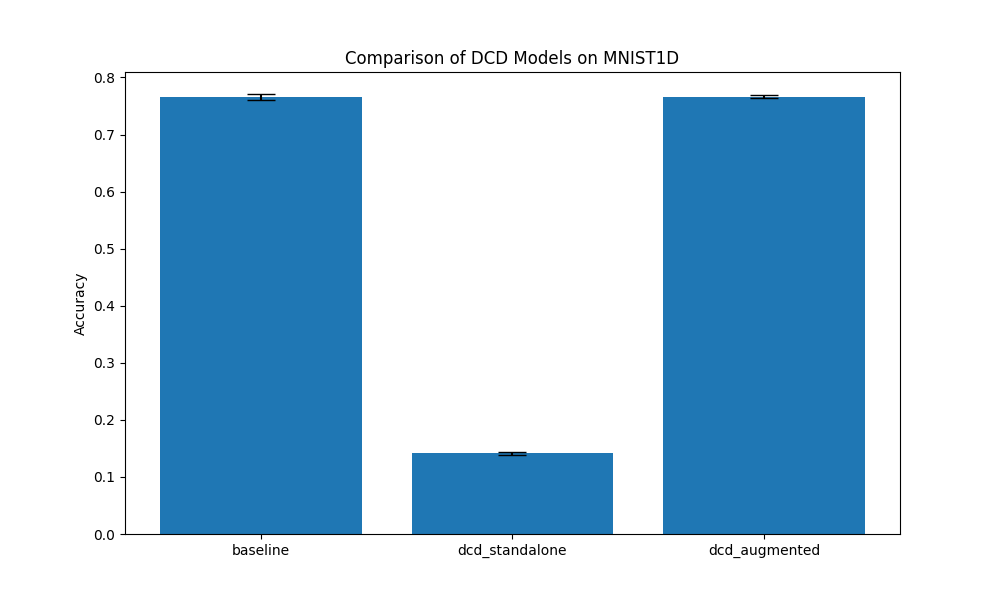

# Differentiable Correlation Dimension (DCD) Experiment

## Hypothesis
Correlation dimension ($D_2$) is a measure of the dimensionality of the space occupied by a set of points (e.g., a phase-space reconstruction of a time series). It is a key tool in nonlinear dynamics and chaos theory. Standard algorithms for estimating $D_2$ (like Grassberger-Procaccia) involve non-differentiable operations like counting points within a radius $r$. We hypothesize that a **Differentiable Correlation Dimension (DCD)** layer, which uses a sigmoid-based soft-counting mechanism and differentiable least-squares regression, can allow neural networks to learn fractal-like properties of signals end-to-end.

## Methodology
The DCD layer implements the following steps:
1.  **Phase Space Reconstruction**: Lifts the 1D signal into an $m$-dimensional space using a learnable/fixed delay $\tau$.
2.  **Pairwise Distances**: Computes the Euclidean distance between all reconstructed points.
3.  **Soft Correlation Integral $C(r)$**: Approximates the proportion of pairs closer than radius $r$ using a sigmoid function:
    $$ C(r) = \frac{2}{N(N-1)} \sum_{i<j} \sigma(\gamma \cdot (r - \|x_i - x_j\|)) $$
    where $\gamma$ is a learnable temperature controlling the "hardness" of the threshold.
4.  **Differentiable Regression**: Estimates $D_2$ as the slope of $\ln(C(r))$ vs $\ln(r)$ using the least-squares method.

We compared three architectures on the `mnist1d` dataset:
-   **Baseline MLP**: A 2-layer MLP on raw features.
-   **DCDMLP (standalone)**: An MLP using only the estimated $D_2$ and the correlation integral values $C(r)$ as input.
-   **DCDAugmentedMLP**: An MLP that combines raw features with DCD features.

Learning rates were tuned using Optuna (10 trials). Final evaluation was performed with 3 different seeds for 30 epochs.

## Results

| Model | Accuracy (Mean +/- Std) |
|-------|------------------------|
| Baseline MLP | 76.58% +/- 0.52% |
| DCDMLP (standalone) | 14.12% +/- 0.28% |
| DCDAugmentedMLP | 76.58% +/- 0.27% |

### Observations
-   **Low Standalone Discriminative Power**: The `DCDMLP` model achieved only ~14% accuracy, which is just above chance for the 10-class `mnist1d` task. This indicates that the correlation dimension and integral values alone do not capture enough information to distinguish between the digit classes in this dataset.
-   **No Improvement from Augmentation**: The `DCDAugmentedMLP` performed identically to the baseline. This suggests that the DCD features are either redundant with what the MLP already learns from the raw signal or do not provide any additional useful signal for this specific classification task.
-   **Dataset Suitability**: The `mnist1d` dataset consists of transformed digits. While $D_2$ is a powerful tool for chaotic or fractal signals, the local geometric structure of these digits may be better captured by standard convolutional or dense layers than by global fractal dimensions.

## Conclusion
The Differentiable Correlation Dimension layer provides a way to integrate nonlinear dynamical invariants into deep learning models. While it did not improve performance on `mnist1d`, it might be more effective for tasks involving complex, multi-scale signals where fractal dimensionality is a known discriminative feature (e.g., physiological signals, turbulence data, or financial time series).
