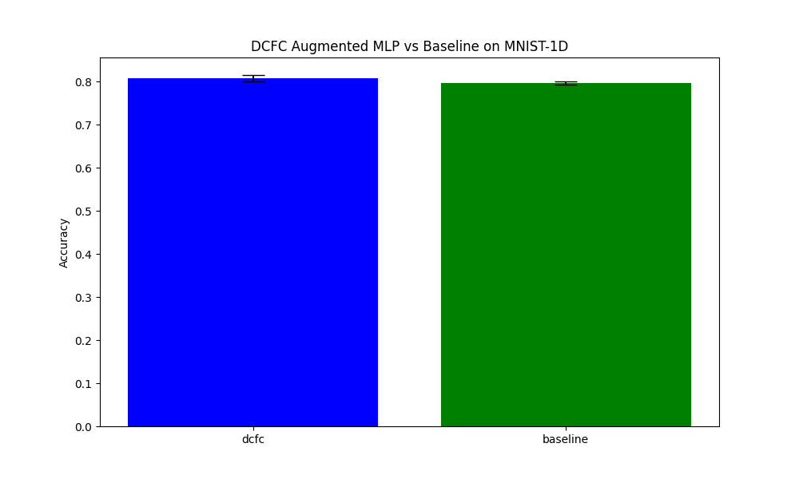

# Differentiable Cross-Frequency Coupling (DCFC) Experiment

This experiment investigates the utility of learnable Phase-Amplitude Coupling (PAC) features for signal classification.

## Methodology
- **DCFCLayer**: Extracts Phase-Amplitude Coupling between learnable pairs of frequencies using Gaussian filters and the Mean Vector Length (MVL) metric.
- **Models**: Compared a baseline MLP with an MLP augmented with DCFC features (16 learned pairs).
- **Dataset**: MNIST-1D.
- **Tuning**: Learning rates were tuned using Optuna.

## Results
| Model | Accuracy |
| :--- | :--- |
| dcfc | 0.8078 +/- 0.0078 |
| baseline | 0.7970 +/- 0.0035 |

