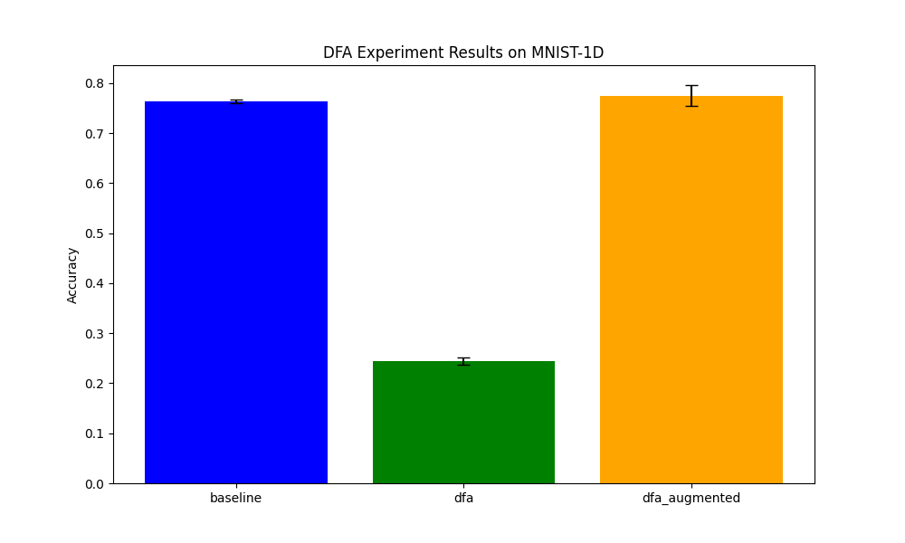

# Differentiable Detrended Fluctuation Analysis (DFA) Experiment

This experiment introduces a **Differentiable Detrended Fluctuation Analysis (DFA)** layer for signal classification. DFA is a classical method in time-series analysis used to estimate the long-range temporal correlations and fractal properties of a signal, often characterized by the scaling exponent $\alpha$.

## Method

The `DifferentiableDFALayer` implements the standard DFA algorithm using differentiable PyTorch operations:
1.  **Integration**: The signal is centered and integrated: $y(k) = \sum_{i=1}^k [x(i) - \langle x \rangle]$.
2.  **Segmentation**: The integrated signal is divided into non-overlapping windows of size $n$.
3.  **Local Detrending**: In each window, a local least-squares linear fit is performed.
4.  **Fluctuation Computation**: The RMS deviation from the local trend is calculated for each window, and the average fluctuation $F(n)$ for scale $n$ is obtained.
5.  **Scaling Exponent ($\alpha$)**: By computing $F(n)$ for multiple scales, we can estimate $\alpha$ as the slope of the log-log plot of $F(n)$ vs $n$.

By making this process differentiable, we allow the neural network to potentially benefit from these long-range correlation features and even backpropagate through them if they were part of a larger learnable preprocessing pipeline (though in this experiment, they are used as fixed-scale feature extractors).

## Experiment Setup

-   **Dataset**: MNIST-1D (10,000 samples).
-   **Models**:
    -   **BaselineMLP**: A standard 3-layer MLP.
    -   **DFANet**: An MLP that only receives the DFA features (4 fluctuation values and 1 alpha exponent).
    -   **DFAAugmentedMLP**: An MLP that receives both the raw signal and the DFA features.
-   **Tuning**: The learning rate for each model was tuned independently using Optuna over 10 trials.
-   **Evaluation**: Results are reported as the mean and standard deviation over 3 independent seeds.

## Results

| Model | Accuracy (Mean ± Std) |
| :--- | :--- |
| **Baseline MLP** | 76.32% ± 0.31% |
| **DFA-only MLP** | 24.45% ± 0.67% |
| **DFA-Augmented MLP** | **77.48% ± 2.11%** |

The DFA-augmented model slightly outperforms the baseline, suggesting that the fractal scaling features provided by DFA provide a useful inductive bias for the MNIST-1D classification task. The DFA-only model, despite using only 5 features, performs significantly better than random guessing (10%), indicating that these global statistical properties carry non-trivial discriminative information.

## Visualization

The results are summarized in the bar plot below:

## Conclusion

This experiment demonstrates that classical time-series analysis methods like DFA can be successfully integrated into differentiable deep learning pipelines. The inclusion of long-range correlation features via a differentiable DFA layer can improve the performance of standard MLPs on signal classification tasks.
