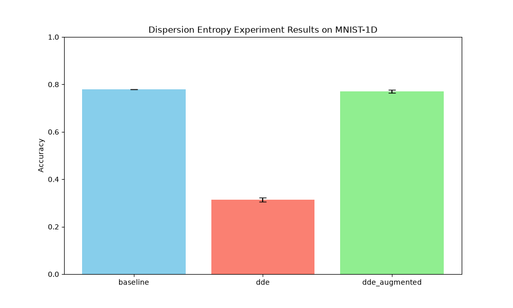

# Differentiable Dispersion Entropy (DDE) Experiment

## Hypothesis
Dispersion Entropy (DE) is a robust complexity measure for time series that addresses some limitations of Permutation Entropy and Sample Entropy. Standard DE is non-differentiable due to its symbolic mapping (discretization). We hypothesize that a **Differentiable Dispersion Entropy (DDE)** layer, using Gaussian soft-binning and soft-pattern counting, can allow a neural network to learn task-optimal discretization and capture complexity features that complement raw signal information.

## Methodology
The DDE layer implements a differentiable version of Dispersion Entropy:
1.  **Soft-discretization**: Maps input values $x$ to $c$ classes using soft-binning. We use Gaussian kernels centered at learnable points $c_i$: $w_{ij} = \text{softmax}(- \frac{(x_i - c_j)^2}{2\sigma^2})$.
2.  **Embedding**: Forms vectors of dimension $m$ with delay $\tau$.
3.  **Soft-pattern counting**: Computes the joint probability of patterns by taking the product of membership weights across the $m$ positions in each window.
4.  **Entropy calculation**: Computes the normalized Shannon Entropy of the averaged pattern distribution.

We compared three models on the `mnist1d` dataset (10,000 samples):
- **Baseline MLP**: 2-layer MLP on raw 40D features.
- **DDEMLP**: MLP taking only the single DDE scalar feature as input.
- **DDEAugmentedMLP**: MLP taking the concatenation of raw features and the DDE feature.

Learning rates were tuned for each model using Optuna (10 trials). Final evaluation was performed over 3 different seeds.

## Results

| Model | Accuracy (Mean +/- Std) |
|-------|------------------------|
| Baseline MLP | 77.97% +/- 0.06% |
| DDEMLP (DDE only) | 31.38% +/- 0.81% |
| DDEAugmentedMLP | 77.03% +/- 0.73% |

### Observations
- **Informative but Insufficient**: `DDEMLP` achieved ~31% accuracy using only a single entropy feature. Given the 10-class problem (chance is 10%), this indicates that DDE captures significant discriminative information about the signal's complexity/structure.
- **Lack of Synergy**: `DDEAugmentedMLP` did not outperform the baseline. This suggests that for `mnist1d`, the information captured by DDE might already be implicitly present or easily learnable from the raw signal by a standard MLP.
- **Optimization Stability**: The DDE layer was successfully trained, and the learnable parameters (bin centers and sigma) received gradients, confirming the differentiability of the soft-binning and pattern counting approach.

## Conclusion
The Differentiable Dispersion Entropy layer provides a way to incorporate complexity-based symbolic dynamics into neural networks. While it didn't provide a performance boost on `mnist1d`, the fact that a single DDE feature can reach 31% accuracy suggests its potential for more complex, non-stationary time series where traditional features might fail. Future work could involve using multiple DDE layers with different $m$ and $\tau$ parameters or using the full pattern distribution as a feature vector.
