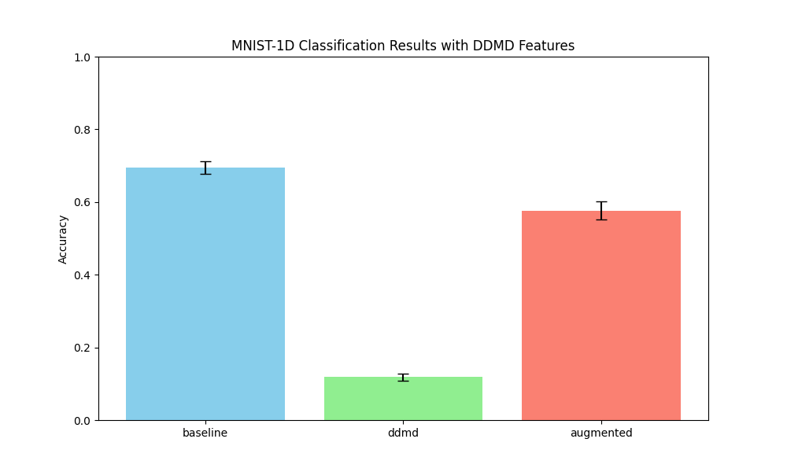

# Differentiable Dynamic Mode Decomposition (DDMD) Experiment

## Hypothesis
Dynamic Mode Decomposition (DMD) is a technique used to extract the underlying linear dynamics of a system. By representing a 1D signal using its time-delay embedding (Hankel matrix), we can find a transition operator $A$ that best describes the evolution of the signal's local state. We hypothesize that the eigenvalues of this operator, which represent the growth/decay rates and oscillation frequencies of the signal's modes, can serve as discriminative features for signal classification.

## Methodology
The **DDMD Layer** implements the following steps:
1.  **Time-Delay Embedding**: Construct a Hankel matrix $H$ with embedding dimension $k=15$ from the 1D signal of length $L=40$.
2.  **Transition Operator**: Solve for $A$ in $Y = AX$ where $X$ and $Y$ are successive columns of $H$, using differentiable least squares (`torch.linalg.lstsq`).
3.  **Eigenvalue Extraction**: Compute the eigenvalues of $A$ using `torch.linalg.eigvals`.
4.  **Stable Representation**: Sort the eigenvalues by magnitude and concatenate their real and imaginary parts to form a fixed-length feature vector of size $2k$.

We compared:
- **Baseline MLP**: A 2-layer MLP on the raw signal.
- **DDMDNet**: A 2-layer MLP using only DDMD features.
- **DDMDAugmentedMLP**: A 2-layer MLP using the concatenation of raw signals and DDMD features.

All models were tuned for learning rate using Optuna (5 trials) and trained for 30 epochs on the `mnist1d` dataset (10,000 samples).

## Results

| Model | Accuracy (Mean +/- Std) | Best LR |
|-------|------------------------|---------|
| Baseline MLP | 69.50% +/- 1.71% | 6.43e-03 |
| DDMDNet | 11.80% +/- 0.99% | 7.99e-03 |
| DDMDAugmentedMLP | 57.60% +/- 2.47% | 7.75e-03 |

## Observations
- **Low Discriminative Power**: `DDMDNet` performed only slightly better than random chance (10%). This suggests that the eigenvalues of the DMD transition operator, at least with the current embedding dimension $k=15$, do not capture enough discriminative information to distinguish MNIST-1D digits.
- **Negative Impact on Training**: The `DDMDAugmentedMLP` performed significantly worse than the `Baseline MLP`. This indicates that adding DDMD features might be introducing noise or making the optimization landscape more difficult, rather than providing useful complementary information.
- **Sensitivity of DMD**: DMD is highly sensitive to noise and the choice of embedding dimension. In a very short and noisy signal like those in MNIST-1D, the "linear dynamics" captured by DMD might be dominated by noise or trivial transitions that do not reflect the global shape of the digit.

## Conclusion
While Differentiable DMD is mathematically sound and integrates well into backpropagation-based training, its eigenvalues alone seem insufficient for the MNIST-1D classification task. The transformation might be discarding too much spatial information that is critical for digit recognition. Future work could explore using DMD modes or combining DMD with other spectral features.
