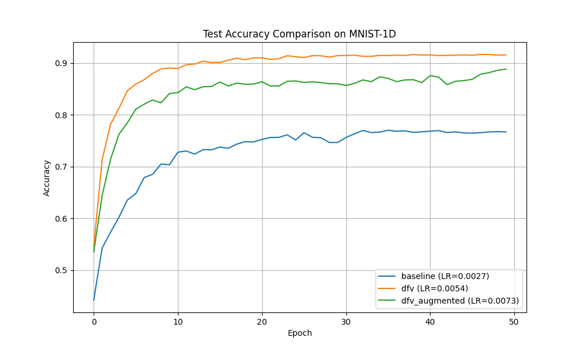

# Differentiable Fisher Vector Layer Experiment

This experiment investigates the effectiveness of a **Differentiable Fisher Vector (DFV) Layer** for 1D signal classification using the MNIST-1D dataset. Fisher Vectors are a powerful image representation technique in computer vision, typically used for encoding local features (like SIFT) into a global descriptor using a Gaussian Mixture Model (GMM). This layer brings that concept into a fully differentiable neural network framework.

## Methodology

### Fisher Vector Encoding
The Fisher Vector $G_{\lambda}^X$ of a set of local descriptors $X = \{x_1, \dots, x_T\}$ is the gradient of the log-likelihood with respect to the parameters $\lambda$ of a GMM, normalized by the Fisher Information Matrix $F_{\lambda}$:
$G_{\lambda}^X = F_{\lambda}^{-1/2} \nabla_{\lambda} \log p(X | \lambda)$

In this implementation, we focus on the gradients with respect to the GMM means ($\mu_k$) and diagonal variances ($\sigma_k^2$). The resulting vector is a concatenation of:
- $u_k = \frac{1}{T\sqrt{w_k}} \sum_{t=1}^T \gamma_t(k) \left(\frac{x_t - \mu_k}{\sigma_k}\right)$
- $v_k = \frac{1}{T\sqrt{2w_k}} \sum_{t=1}^T \gamma_t(k) \left[\frac{(x_t - \mu_k)^2}{\sigma_k^2} - 1\right]$

where $w_k$ are the mixture weights and $\gamma_t(k)$ are the soft assignments (responsibilities) of descriptor $x_t$ to cluster $k$.

### Implementation Details
- **Learnable GMM**: The mixture weights, means, and log-variances are all learnable parameters updated via backpropagation.
- **Normalization**: Following standard Fisher Vector practices, we apply:
  1. **Power Normalization**: $f(z) = \text{sign}(z) \sqrt{|z|}$ to improve robustness against bursty features.
  2. **L2 Normalization**: To make the descriptor invariant to the number of patches.
- **Input Processing**: 1D signals are decomposed into overlapping patches using a sliding window.

## Experimental Setup
- **Dataset**: MNIST-1D (10,000 samples).
- **Models**:
  1. **BaselineMLP**: A standard 3-layer MLP.
  2. **DFVNet**: Fisher Vector Layer (8 clusters, patch size 10, stride 5) followed by a 2-layer MLP.
  3. **DFVAugmentedMLP**: Concatenation of the raw signal and Fisher Vector features, followed by a 3-layer MLP.
- **Tuning**: Learning rates were tuned for each model using Optuna (10 trials).
- **Evaluation**: Results are averaged over 3 random seeds, each trained for 50 epochs.

## Results

| Model | Test Accuracy | Best LR |
|-------|---------------|---------|
| BaselineMLP | 76.72% ± 0.51% | 0.0027 |
| **DFVNet** | **91.60% ± 0.40%** | 0.0054 |
| DFVAugmentedMLP | 88.83% ± 0.65% | 0.0073 |

## Conclusion
The Differentiable Fisher Vector Layer significantly outperformed the baseline MLP on the MNIST-1D dataset. Remarkably, the `DFVNet` achieved the highest accuracy, suggesting that the Fisher Vector encoding provides a highly discriminative and structured feature representation that is superior to raw signal input for this task. The differentiability of the GMM parameters allows the network to learn a "codebook" of patches that is specifically optimized for the classification objective.
