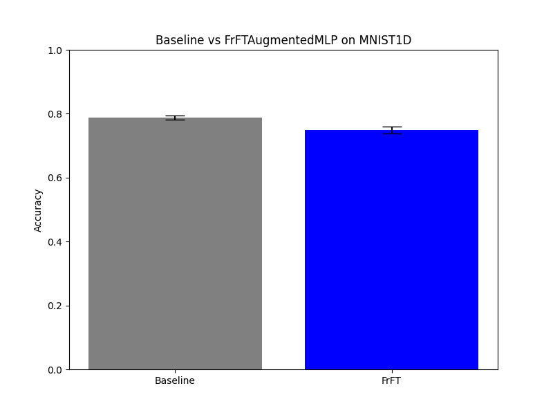

# Differentiable Fractional Fourier Transform (FrFT) Experiment

## Hypothesis
The Fractional Fourier Transform (FrFT) generalizes the standard Fourier Transform by introducing a fractional order $\alpha$. It can be seen as a rotation of the signal in the time-frequency plane. We hypothesize that a **Differentiable FrFT Layer**, where the fractional orders $\alpha$ are learnable parameters, can allow a neural network to automatically find the optimal intermediate time-frequency representations for a given task. This should provide a more flexible inductive bias than either the raw time domain ($\alpha=0$) or the pure frequency domain ($\alpha=1$).

## Methodology
- **FrFT Layer**: Implemented using the eigendecomposition of the Discrete Fourier Transform (DFT) matrix. The transform for a fractional order $\alpha$ is computed as:
  $$ X_\alpha = \sum_{k=0}^3 e^{-i \pi k \alpha / 2} P_k x $$
  where $P_k$ are the projectors onto the four eigenspaces of the DFT matrix.
- **Architecture (FrFTAugmentedMLP)**: Input signals are augmented with the magnitude of their FrFT at several learnable fractional orders (initialized uniformly between 0 and 1). The combined features are passed through a 3-layer MLP.
- **Architecture (BaselineMLP)**: A standard 3-layer MLP with a larger hidden dimension (320 vs 256) to match the total number of parameters of the FrFT-augmented model.
- **Dataset**: `mnist1d` (10,000 samples).
- **Hyperparameter Tuning**: Learning rates for both models were tuned using Optuna (10 trials each).
- **Evaluation**: Final evaluation over 3 random seeds for 40 epochs each.

## Results

| Model | Accuracy (Mean +/- Std) |
|-------|------------------------|
| Baseline MLP | 78.70% +/- 0.64% |
| FrFTAugmentedMLP | 74.92% +/- 1.04% |

### Observations
- **Performance**: The FrFT-augmented MLP was outperformed by the parameter-matched Baseline MLP on the `mnist1d` dataset.
- **Information Redundancy**: The FrFT features might be redundant for the `mnist1d` task, where spatial localized features are highly discriminative. Standard MLP layers might be more efficient at extracting these features from the raw input than through a global fractional frequency transformation.
- **Optimization**: The complex-valued nature of the FrFT and the use of its magnitude might introduce non-linearities that make the optimization landscape more difficult to navigate compared to a standard MLP, as suggested by the higher variance and lower mean accuracy.
- **Task Suitability**: While FrFT is powerful for signals with chirps or varying time-frequency characteristics, `mnist1d` digits might not benefit as much from this specific inductive bias.

## Conclusion
The Differentiable FrFT Layer successfully implements a learnable rotation in the time-frequency plane. However, for the `mnist1d` dataset, augmenting the model with these features did not provide a performance advantage over a standard MLP of similar size. Future work could explore using FrFT in a convolutional setting (FrFT-based filtering) or applying it to datasets with more complex non-stationary spectral content.

## Verification
The FrFT layer was verified to be differentiable with respect to $\alpha$ and correctly implements the Identity ($\alpha=0$) and DFT ($\alpha=1$) transforms in `test_logic.py`.
