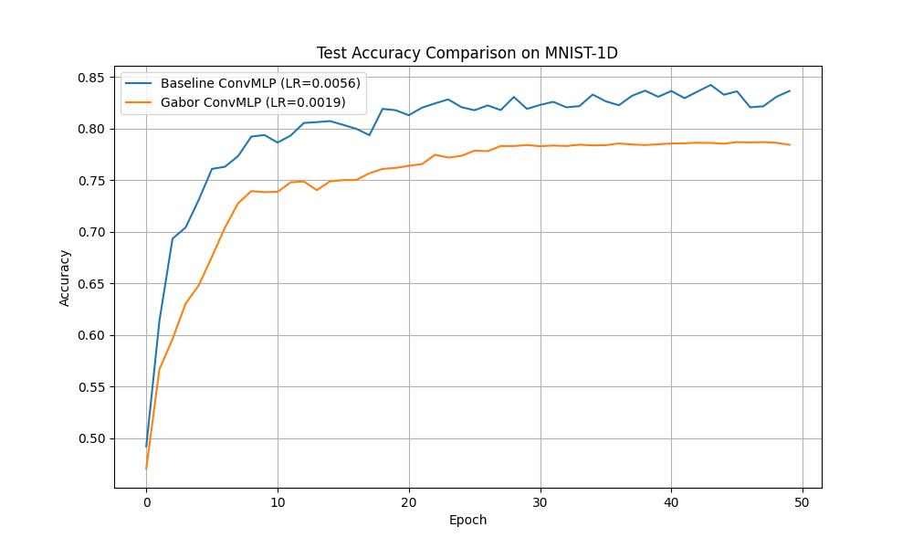

# Differentiable Gabor Filter Experiment

This experiment investigates the use of a **Differentiable Gabor Filter Layer** as a replacement for standard standard 1D convolutions in a simple signal classification task (MNIST-1D).

## Methodology

### Gabor Layer
The Gabor layer implements a 1D convolution where the kernel is generated from three learnable parameters per filter:
- **Frequency ($f$):** Controls the oscillations of the sinusoid.
- **Sigma ($\sigma$):** Controls the width of the Gaussian envelope.
- **Phase ($\phi$):** Controls the offset of the sinusoid.

The kernel is computed as:
$$g(x) = \exp\left(-\frac{x^2}{2\sigma^2}\right) \cos(2\pi f x + \phi)$$
where $x$ is a grid of values from -1 to 1.

### Architectures
- **BaselineConvMLP:** A standard `nn.Conv1d` layer followed by a 2-layer MLP.
- **GaborConvMLP:** A `GaborLayer` followed by a 2-layer MLP.

Both models used 16 filters with a kernel size of 15.

## Results

Hyperparameters (learning rate) were tuned using Optuna for 15 trials each. The final evaluation was performed across 3 random seeds.

| Model | Best LR | Final Test Accuracy |
|-------|---------|---------------------|
| Baseline ConvMLP | 0.0070 | 84.25% ± 3.63% |
| Gabor ConvMLP | 0.0059 | 78.42% ± 1.19% |

## Observations
1. **Convergence:** The Gabor-based model converges more slowly than the baseline ConvMLP.
2. **Performance:** In this specific configuration on MNIST-1D, the baseline ConvMLP outperformed the Gabor model. This might be because standard convolutions can learn any arbitrary kernel shape, whereas the Gabor layer is constrained to a specific functional form.
3. **Stability:** The Gabor model showed lower variance across seeds (±1.19%) compared to the baseline (±3.63%), suggesting that the structural constraint of Gabor filters might act as a form of regularization.

## Conclusion
While the Differentiable Gabor Layer is successfully learnable and provides a strong inductive bias for periodic patterns, it did not outperform a standard convolution on the MNIST-1D dataset in this experiment. Further tuning of the initialization or its use in deeper architectures might yield better results.
