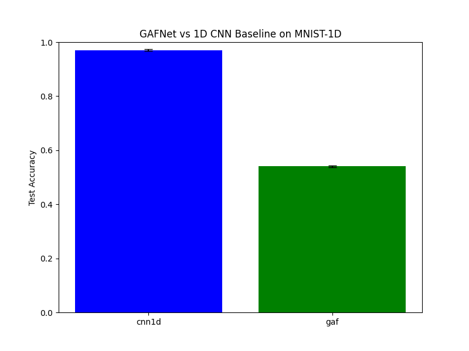

# Differentiable Gramian Angular Field (GAF) Experiment

## Hypothesis
The Gramian Angular Field (GAF) is a popular technique for encoding 1D time-series data into 2D images, allowing the use of 2D Convolutional Neural Networks (CNNs). Standard GAF implementations are often used as a fixed preprocessing step. We hypothesize that by making the GAF transformation **differentiable** and part of the end-to-end training process, we can learn better features for signal classification.

## Methodology
The `DifferentiableGAF` layer implements the following steps in a differentiable manner:
1.  **Min-Max Scaling**: Scales the input signal $x$ to $[-1, 1]$.
2.  **Polar Transformation**: Computes $\phi = \arccos(x)$.
3.  **Gramian Angular Summation Field (GASF)**: Computes $G_{ij} = \cos(\phi_i + \phi_j)$.

We compared two architectures on the `mnist1d` dataset:
1.  **GAFNet**: A model that first applies the `DifferentiableGAF` layer to the 1D signal (length 40), then processes the resulting 40x40 image with a 2D CNN.
2.  **CNN1D (Baseline)**: A standard 1D CNN operating directly on the 1D signal.

Both models were tuned to have approximately **210,000 parameters** to ensure a fair comparison. Learning rates were tuned for both models using Optuna (5 trials) on the validation set. Final evaluation was performed on the test set over 2 seeds.

## Results

| Model | Test Accuracy (Mean +/- Std) | Best LR |
|-------|----------------------------|---------|
| CNN1D (Baseline) | 97.08% +/- 0.32% | 2.8137e-03 |
| GAFNet | 54.05% +/- 0.35% | 6.2642e-03 |

### Observations
- **Significant Performance Gap**: The 1D CNN baseline significantly outperformed the GAF-based model.
- **Information Density**: MNIST-1D signals are relatively short (40 samples). Expanding this into a 40x40 Gramian matrix (1600 elements) might be introducing too much redundancy or sparse information for the 2D CNN to handle effectively compared to the direct 1D representation.
- **Inductive Bias**: 1D convolutions have a strong and appropriate inductive bias for the local temporal patterns in MNIST-1D. The GAF transformation, while capturing global temporal correlations, might be distorting these local features in a way that makes them harder for a 2D CNN to extract.
- **Optimization**: The GAF transformation involves `acos` and `cos` operations, which might create a more complex loss landscape compared to the linear operations in a standard CNN.

## Conclusion
While the Differentiable Gramian Angular Field layer successfully allows end-to-end training of image-based signal classifiers, it does not provide a benefit for the MNIST-1D dataset compared to a parameter-matched 1D CNN. This suggests that for short signals with strong local features, direct 1D processing remains superior to 2D image-based encodings.
