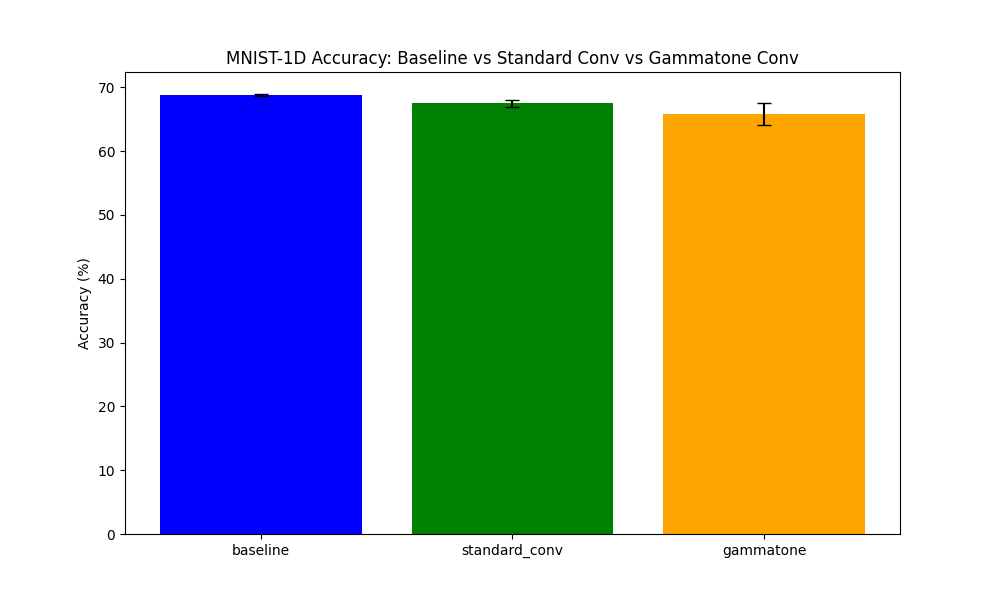

# Differentiable Gammatone Filterbank Experiment

This experiment evaluates a Differentiable Gammatone Layer for signal classification on the MNIST-1D dataset.

## Method

The Gammatone impulse response is defined as:
$$g(t) = t^{n-1} e^{-2\pi b t} \cos(2\pi f t + \phi)$$
where $n=4$ (standard for auditory modeling), $b$ is the bandwidth, $f$ is the center frequency, and $\phi$ is the phase.

The filterbank is implemented as a 1D convolution layer where the kernels are generated from these parameters. The entire process is differentiable, allowing the model to learn the optimal filters for the task.

## Results

| Model | Accuracy | Best LR |
|-------|----------|---------|
| baseline | 68.83% ± 0.12% | 0.008410 |
| standard_conv | 67.50% ± 0.54% | 0.000743 |
| gammatone | 65.87% ± 1.70% | 0.001552 |

