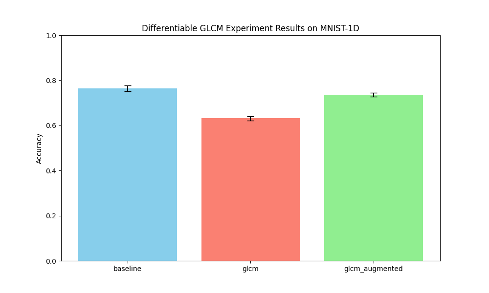

# Differentiable Gray-Level Co-occurrence Matrix (GLCM) Experiment

## Methodology

This experiment introduces a **Differentiable Gray-Level Co-occurrence Matrix (GLCM)** layer for 1D signal analysis. GLCM is a classic texture analysis method typically used in image processing to capture spatial relationships between pixel intensities. In this 1D implementation, we adapt it to capture temporal relationships between signal values at different offsets.

### Differentiable Implementation
To make the GLCM computation differentiable, we employ **Soft Binning**:
1.  **Gaussian Kernels**: Instead of hard-assigning signal values to discrete bins, we use Gaussian kernels with learnable centers ($\mu_k$) and scale ($\sigma$). The weight of a signal value $x_t$ for bin $k$ is $w_{t,k} = \exp(-0.5(\frac{x_t - \mu_k}{\sigma})^2)$.
2.  **Normalization**: The weights are normalized per time step so they sum to 1 across bins.
3.  **Co-occurrence Matrix**: For a given offset $d$, the co-occurrence matrix $P$ is computed as:
    $$P_{i,j} = \frac{\sum_{t=1}^{T-d} w_{t,i} \cdot w_{t+d,j}}{\sum_{t=1}^{T-d} \sum_{i',j'} w_{t,i'} \cdot w_{t+d,j'}}$$
4.  **Haralick Features**: We compute five standard Haralick features from the normalized matrix $P$:
    -   **Contrast**: $\sum_{i,j} (i-j)^2 P_{i,j}$
    -   **Energy (ASM)**: $\sum_{i,j} P_{i,j}^2$
    -   **Homogeneity**: $\sum_{i,j} \frac{P_{i,j}}{1 + (i-j)^2}$
    -   **Entropy**: $-\sum_{i,j} P_{i,j} \ln(P_{i,j} + \epsilon)$
    -   **Correlation**: $\sum_{i,j} \frac{(i-\mu_i)(j-\mu_j)P_{i,j}}{\sigma_i \sigma_j}$

### Models
-   **BaselineMLP**: A standard 3-layer MLP acting directly on the raw signal.
-   **GLCMMLP**: An MLP that takes only the GLCM features (5 features per offset) as input.
-   **GLCMAugmentedMLP**: An MLP that takes both the raw signal and the GLCM features as input.

## Experiment Setup
-   **Dataset**: MNIST-1D (10,000 samples, 40 points per signal).
-   **Tuning**: Learning rate for each model was tuned using Optuna over 10 trials.
-   **Evaluation**: Final results computed over 3 different seeds using the best learning rate.
-   **Hyperparameters**: 8 bins, offsets $d \in \{1, 2, 3, 5\}$.

## Results

| Model | Test Accuracy | Best LR |
| :--- | :---: | :---: |
| BaselineMLP | 76.40% ± 1.28% | 0.005163 |
| GLCMMLP | 63.17% ± 1.00% | 0.014302 |
| GLCMAugmentedMLP | 73.57% ± 0.90% | 0.002563 |

## Discussion

The results indicate that for the MNIST-1D dataset:
1.  **Lower Discriminative Power**: Standalone GLCM features (`GLCMMLP`) reached ~63% accuracy, which is significantly lower than the raw signal baseline (~76%). This suggests that while GLCM captures important statistical properties, it discards too much phase/structural information necessary for this task.
2.  **No Benefit from Augmentation**: Adding GLCM features to the raw signal (`GLCMAugmentedMLP`) actually slightly decreased performance (73.57% vs 76.40%). This could be due to the increased input dimensionality making optimization harder or the GLCM features providing redundant/noisy signals that the network overfits to.
3.  **Soft Binning Stability**: The differentiable implementation was numerically stable and the learnable parameters (centers and sigma) successfully received gradients, allowing the network to potentially adapt the binning strategy to the data distribution.

In conclusion, while the Differentiable GLCM layer successfully integrates classic texture features into a neural network, it may be better suited for tasks where the "texture" or statistical relationship between signal values is the primary differentiator (e.g., physiological signals like ECG/EEG) rather than shape-based classification like MNIST-1D.
