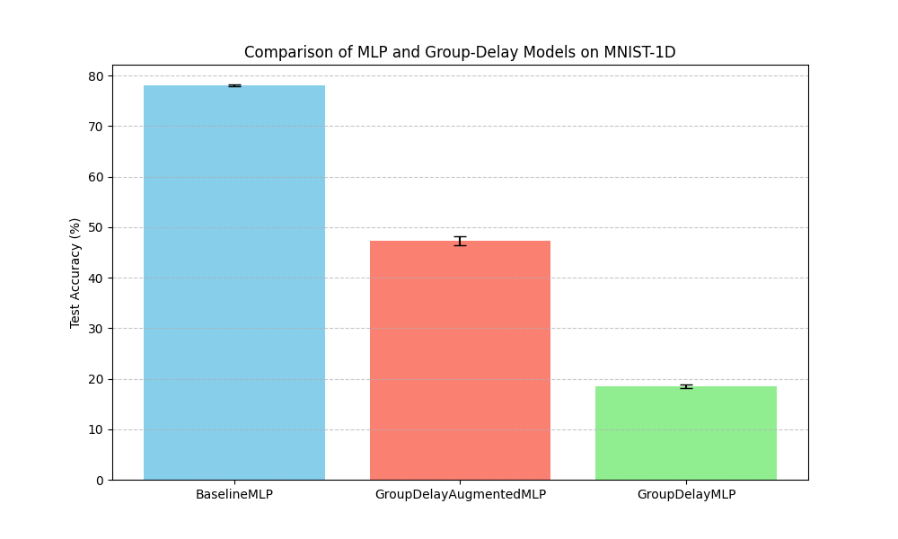

# Differentiable Group Delay Experiment

This experiment investigates the utility of **Differentiable Group Delay** as a feature for 1D signal classification using the `mnist1d` dataset.

## Hypothesis
Group delay, defined as the negative derivative of the phase with respect to frequency, captures the time-delay characteristics of different frequency components in a signal. We hypothesize that providing the group delay as an explicit, differentiable feature to a neural network will improve its ability to classify signals that are characterized by frequency-dependent delays or phase shifts.

## Methodology

### Differentiable Group Delay Layer
The group delay $\tau_g(\omega)$ is computed using the following differentiable FFT-based formula:
$$\tau_g(\omega) = \text{Re} \left\{ \frac{\mathcal{F}\{n \cdot x[n]\}}{\mathcal{F}\{x[n]\}} \right\}$$
where $\mathcal{F}$ denotes the Fourier Transform and $n$ is the time index. For numerical stability, we use:
$$\tau_g(\omega) = \text{Re} \left\{ \frac{\mathcal{F}\{n \cdot x[n]\} \cdot \mathcal{F}\{x[n]\}^*}{|\mathcal{F}\{x[n]\}|^2 + \epsilon} \right\}$$

### Models
1.  **BaselineMLP**: A 3-layer MLP with BatchNorm and ReLU, taking the raw 40-dimensional signal as input.
2.  **GroupDelayAugmentedMLP**: An MLP that takes the concatenation of the raw signal and its group delay (21 features from `torch.fft.rfft`).
3.  **GroupDelayMLP**: An MLP that takes only the group delay as input.

### Training Setup
- **Dataset**: `mnist1d` (10,000 samples).
- **Hyperparameter Tuning**: Learning rates were tuned for each model using Optuna (10 trials, 15 epochs each).
- **Evaluation**: The best learning rate for each model was evaluated over 3 different seeds for 50 epochs.

## Results

| Model | Test Accuracy (Mean +/- Std) | Best LR |
|---|---|---|
| **BaselineMLP** | **78.08% +/- 0.16%** | 0.00706 |
| GroupDelayAugmentedMLP | 47.33% +/- 0.95% | 0.00115 |
| GroupDelayMLP | 18.57% +/- 0.37% | 0.00893 |

## Analysis
- **Performance**: The `BaselineMLP` significantly outperformed both models using group delay features.
- **Information Loss**: The `GroupDelayMLP` performed poorly (18.57%), suggesting that group delay alone is not a sufficient representation for `mnist1d` classification.
- **Interference**: Interestingly, augmenting the raw signal with group delay (`GroupDelayAugmentedMLP`) led to a substantial decrease in performance (47.33% vs 78.08%). This suggests that the group delay features might be noisy or provide a confusing signal that hinders the MLP's ability to learn from the raw inputs.
- **Sensitivity**: Group delay is sensitive to zeros in the Z-transform (where the denominator in the formula becomes small). Despite the $\epsilon$ term, this sensitivity might make the features unstable or difficult for the network to utilize effectively.

## Conclusion
While group delay is a classic tool in signal processing for analyzing phase characteristics, it did not provide an advantage for the `mnist1d` classification task in this experiment. In fact, it appeared to be detrimental when used as an augmentation. This may be due to the specific nature of `mnist1d` where spatial/temporal patterns are more discriminative than frequency-dependent delays, or due to the instability of the group delay calculation on short, noisy signals.

## Verification
- **Mathematical Correctness**: Verified that the layer correctly computes the group delay of a delayed impulse (e.g., for $\delta[n-k]$, $\tau_g = k$).
- **Differentiability**: Verified that gradients flow correctly through the layer to the input signal.
