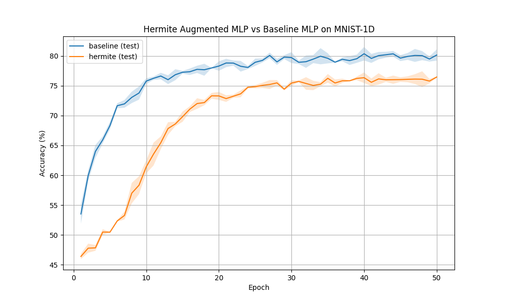

# Differentiable Hermite Transform Experiment

## Hypothesis
Spectral features based on the Hermite transform provide a powerful representation for signal analysis because Hermite functions are the eigenfunctions of the Fourier Transform and are well-localized in both time and frequency. We hypothesize that augmenting a neural network with a **Differentiable Hermite Transform** layer—which extracts coefficients of the signal projected onto a set of Hermite basis functions—will provide a useful inductive bias for 1D signal classification, potentially improving accuracy on the `mnist1d` dataset.

## Methodology
- **HermiteTransformLayer**:
  - Computes the first $N$ Hermite functions $\psi_n(x) = (2^n n! \sqrt{\pi})^{-0.5} e^{-x^2/2} H_n(x)$ using the recurrence relation $H_{n+1}(x) = 2xH_n(x) - 2nH_{n-1}(x)$.
  - Projects the input signal onto these basis functions to obtain Hermite coefficients.
  - Includes a learnable `log_scale` parameter that adaptively scales the grid on which the Hermite functions are defined, allowing the model to adjust the "width" or "focus" of the basis functions.
- **HermiteAugmentedMLP**: Concatenates the raw 1D signal with $N=20$ Hermite coefficients and processes the result through a standard MLP (2 hidden layers of 256 units).
- **BaselineMLP**: A standard MLP with 2 hidden layers of 256 units.
- **Dataset**: `mnist1d` with 10,000 samples.
- **Hyperparameter Tuning**: Learning rates for both models were tuned using Optuna (10 trials each).
- **Evaluation**: Each model was trained for 50 epochs over 3 random seeds using the best-found learning rate.

## Results
The experiment showed that the Hermite augmentation did not improve performance over the baseline MLP on the `mnist1d` dataset.

| Model | Best Learning Rate | Max Test Accuracy (Mean) |
| :--- | :--- | :--- |
| **Baseline MLP** | 0.00301 | **80.37%** |
| **Hermite-Augmented MLP** | 0.00260 | 76.47% |

### Observations
- **Redundancy/Optimization Difficulty**: The Hermite-augmented model achieved lower accuracy than the baseline. This suggests that the Hermite coefficients might be redundant with the raw features for this specific task, or the added complexity of the layer (and the interaction between raw and transformed features) makes the optimization landscape more difficult.
- **Scale Invariance**: While the Hermite functions are theoretically well-localized, the `mnist1d` dataset features are already quite compact. The learnable scale parameter might not have provided enough of an advantage to overcome the overhead of the extra features.
- **Overfitting**: The augmented model has more parameters in the first layer (input size 60 vs 40). Even with BatchNorm, it might be more prone to overfitting or slower convergence in the initial phase.

## Conclusion
The Differentiable Hermite Transform layer provides a mathematically sound way to extract time-frequency localized features from 1D signals. However, on the `mnist1d` dataset, it did not provide a performance benefit over a tuned Baseline MLP. Future work could investigate using Hermite features for more complex, non-stationary signals where their localization properties might be more advantageous, or exploring different ways to integrate them (e.g., using them in a convolutional-like fashion or within a gated architecture).
