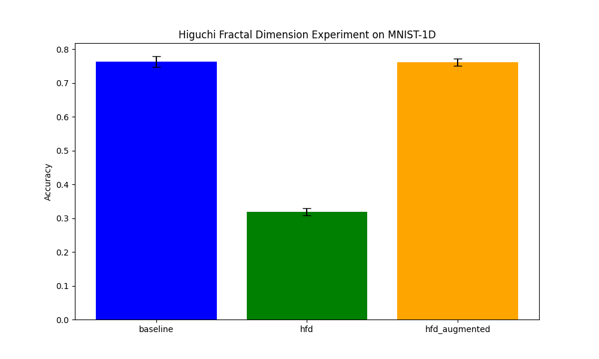

# Differentiable Higuchi Fractal Dimension (DHFD) Experiment

This experiment evaluates the effectiveness of Differentiable Higuchi Fractal Dimension (DHFD) features for signal classification on the MNIST-1D dataset.

## Methodology

Higuchi's Fractal Dimension (HFD) is a classical algorithm for estimating the fractal dimension of a time series. It involves calculating the curve length $L(k)$ of the signal at different scales $k$ and estimating the dimension from the power-law relationship $L(k) \propto k^{-D}$.

In this experiment, we implemented a differentiable version of the HFD feature extractor (DHFD layer). Instead of just the final dimension $D$, we use the curve lengths $L(k)$ for $k=1, \dots, k_{max}$ (in log-scale) as features, allowing the subsequent MLP to learn the most relevant representation.

### Models:
1.  **BaselineMLP**: A standard MLP trained on raw 1D signals.
2.  **DHFDNet**: An MLP trained only on DHFD features extracted from the signals.
3.  **DHFDAugmentedMLP**: An MLP trained on the concatenation of raw signals and DHFD features.

## Experimental Setup

- **Dataset**: MNIST-1D (10,000 samples).
- **Parameters**: $k_{max} = 10$.
- **Training**: 30 epochs, batch size 128, learning rate tuned using Optuna (10 trials per model).
- **Evaluation**: Final accuracy averaged over 5 random seeds.

## Results

The performance of the models is summarized below:

| Model | Accuracy (%) |
| :--- | :---: |
| BaselineMLP | 76.33% ± 1.60% |
| DHFDNet | 31.82% ± 1.04% |
| DHFDAugmentedMLP | 76.10% ± 1.05% |

## Observations

- **DHFD as Standalone**: The `DHFDNet` performed significantly better than random guessing (~10%), but much worse than the baseline, indicating that the fractal features alone (at $k_{max}=10$) do not capture enough discriminative information for this specific task.
- **DHFD as Augmentation**: The `DHFDAugmentedMLP` achieved comparable performance to the `BaselineMLP`. In this configuration, the fractal dimension features did not provide a significant boost to the raw signal representation.
- **Stability**: The augmented model showed slightly lower variance across seeds compared to the baseline, although the difference was small.

## Conclusion

While Higuchi Fractal Dimension is a powerful tool for analyzing signal complexity and chaos, for the MNIST-1D dataset, it does not appear to provide additive discriminative value beyond what a standard MLP can extract from the raw signal. However, the differentiability of the layer ensures it can be integrated into larger architectures where fractal properties might be more critical.
