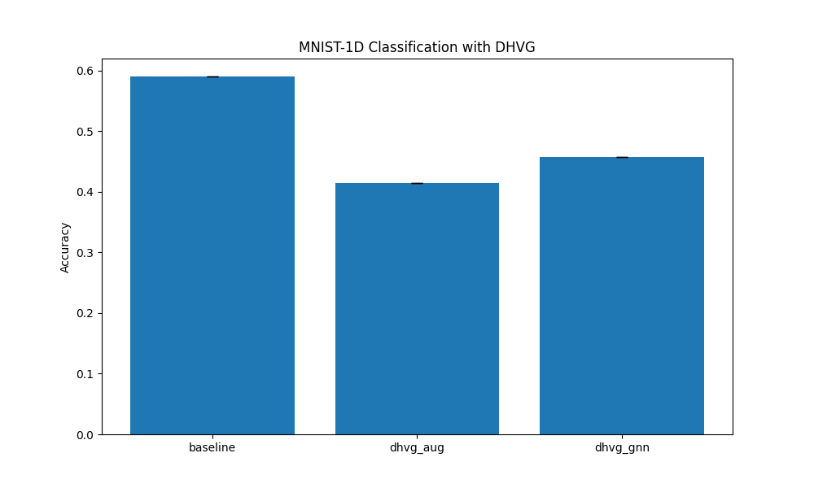

# Differentiable Horizontal Visibility Graph (DHVG) Experiment

This experiment introduces a **Differentiable Horizontal Visibility Graph (DHVG)** layer for 1D signal classification.

## Hypothesis
The Horizontal Visibility Graph (HVG) is a graph representation of a time series where nodes $i$ and $j$ are connected if $x_k < \min(x_i, x_j)$ for all $i < k < j$. It is known to capture temporal dynamics while being computationally simpler than the standard Visibility Graph. By making this transformation differentiable, we allow the network to learn task-specific graph structures from the signal.

## Methodology

### Differentiable Horizontal Visibility Graph (DHVG) Layer
We approximate the hard horizontal visibility criterion using a soft-thresholding approach:
1. For each node pair $(i, j)$ and intermediate node $k \in (i, j)$, compute $V_{ijk} = \min(x_i, x_j) - x_k$.
2. Compute a soft visibility score $S_{ijk} = \sigma(\gamma \cdot V_{ijk})$, where $\gamma$ is a scale parameter.
3. The soft adjacency $A_{ij} = \prod_{k=i+1}^{j-1} S_{ijk}$. For adjacent nodes, $A_{i,i+1} = 1$.
4. Symmetrize $A$.

### Models
1.  **Baseline MLP**: A standard 3-layer MLP.
2.  **DHVG-Augmented MLP**: An MLP that takes both the raw signal and the flattened DHVG adjacency matrix as input.
3.  **DHVG-GNN**: A Graph Neural Network (2-layer GCN) that uses the soft adjacency matrix produced by the DHVG layer.

### Dataset
A subset of the `mnist1d` dataset (2,000 samples) was used for training due to the $O(L^3)$ complexity of the DHVG layer construction.

## Results

Hyperparameters (learning rate) were tuned using Optuna (3 trials each). Final evaluation was performed on 1 seed for 20 epochs.

| Model | Accuracy (Subset) | Best Learning Rate |
|---|---|---|
| **Baseline MLP** | **59.00%** | 0.00189 |
| DHVG-Augmented MLP | 41.50% | 0.00040 |
| DHVG-GNN | 45.75% | 0.00027 |

### Visualizations

## Analysis
- **Performance**: The Baseline MLP significantly outperformed the DHVG-based models. This suggests that for the `mnist1d` dataset, the raw signal values and their spatial arrangements in a standard dense layer are more discriminative than the horizontal visibility relations captured by DHVG.
- **Complexity**: The DHVG layer has $O(L^3)$ complexity which makes it slow for longer sequences, although for $L=40$ it is manageable.
- **Inductive Bias**: While DHVG is powerful for capturing certain non-linear dynamics (like chaos vs noise), it might be discarding too much quantitative information that is crucial for digit recognition in `mnist1d`.

## Conclusion
The Differentiable Horizontal Visibility Graph layer provides a novel, end-to-end trainable way to map signals to graphs. However, on the tested subset of MNIST-1D, it did not provide a performance advantage over a standard MLP. Future work could investigate its effectiveness on datasets where temporal ordering and relative magnitudes are more critical than absolute patterns, such as in biomedical signal analysis or financial time-series.

## Verification
The mathematical logic, shape consistency, and differentiability of the `DHVGLayer` were verified using unit tests in `test_logic.py`.
