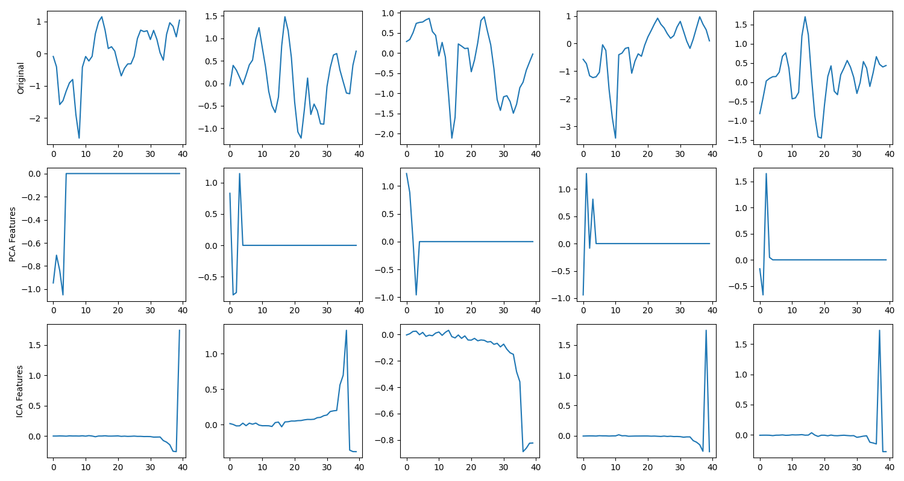

# Differentiable Independent Component Analysis (DICA) Experiment

This experiment investigates the effectiveness of integrating a **Differentiable Independent Component Analysis (DICA)** layer into a neural network for 1D signal classification on the `mnist1d` dataset.

## Motivation
Independent Component Analysis (ICA) is a classical technique for separating a multivariate signal into additive subcomponents that are maximally independent. Unlike PCA, which focuses on uncorrelatedness (second-order statistics), ICA aims for higher-order independence by maximizing non-Gaussianity. Making ICA differentiable allows the network to learn optimal "independent" features end-to-end.

## Methodology
- **DICA Layer**: Implements an unrolled FastICA algorithm (fixed-point iteration) using a `tanh` nonlinearity. It includes:
    - **Whitening**: Differentiable whitening using Eigendecomposition.
    - **Symmetric Decorrelation**: Ensures the weight matrix $W$ is orthogonal using SVD.
    - **Stability Mechanisms**: To handle permutation and sign ambiguity inherent in ICA:
        - **Sign Normalization**: Components are flipped to ensure positive skewness.
        - **Kurtosis Sorting**: Components are sorted by their absolute kurtosis (a measure of non-Gaussianity), providing a consistent order for the following layers.
- **Models Compared**:
    - `baseline`: A standard 3-layer MLP.
    - `pca`: MLP where the input is first transformed by a differentiable PCA whitening layer.
    - `ica`: MLP where the input is first transformed by the DICA layer.
    - `pca_aug`: MLP where the PCA-whitened features are concatenated with the raw input.
    - `ica_aug`: MLP where the DICA features are concatenated with the raw input.

## Results

All models were tuned for learning rate using Optuna (5 trials) and evaluated across 5 random seeds for 50 epochs each.

| Model | Accuracy (Mean +/- Std) | Best Learning Rate |
| :--- | :--- | :--- |
| **Baseline MLP** | **73.52% +/- 1.67%** | 0.008253 |
| **PCA-only** | 38.76% +/- 1.05% | 0.002178 |
| **ICA-only** | 18.33% +/- 0.49% | 0.000725 |
| **PCA-Augmented** | 72.75% +/- 0.55% | 0.007898 |
| **ICA-Augmented** | 73.10% +/- 0.63% | 0.007878 |

### Discussion
- **Information Loss**: Standalone PCA and ICA models perform significantly worse than the baseline. This suggests that the linear projection to a fixed number of "independent" or "principal" components discards crucial discriminative information present in the raw signal for the `mnist1d` task.
- **Augmentation**: The augmented models (`pca_aug` and `ica_aug`) achieved performance very close to the baseline. While they didn't provide a significant boost, they show that the network can successfully integrate these features when the raw signal is still available.
- **DICA Stability**: Even with kurtosis-based sorting and sign normalization, DICA features alone were less discriminative than PCA features for this dataset.

## Visualization
The following plot compares the original signals with their PCA and ICA transformed versions.

*Figure: Original 1D signals vs. learned PCA and ICA features.*
