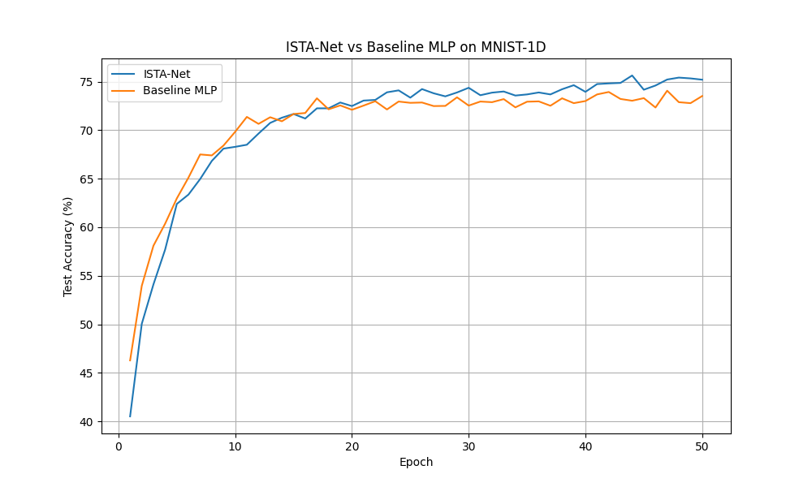

# Differentiable ISTA Experiment

## Hypothesis
Using a differentiable Iterative Soft-Thresholding Algorithm (ISTA) layer to learn a sparse representation of input features can provide a better inductive bias for signal classification tasks than standard dense layers.

## Results
- **ISTA-Net**: 75.85% +/- 1.19%
- **Baseline MLP**: 74.55% +/- 0.50%

