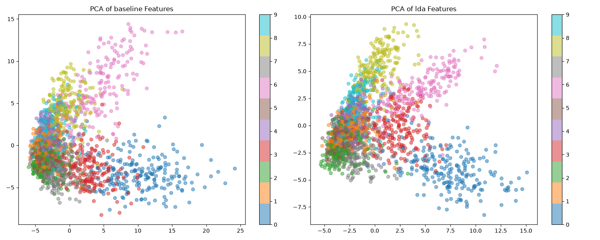

# Differentiable Linear Discriminant Analysis (LDA) Regularization

## Hypothesis
Linear Discriminant Analysis (LDA) is a classical technique that finds a projection where classes are well-separated by maximizing between-class variance ($S_B$) relative to within-class variance ($S_W$). We hypothesize that using a **Differentiable LDA loss** as a regularizer in the intermediate layers of a neural network can encourage the model to learn more discriminative features, leading to better classification performance and more structured feature spaces.

## Methodology
- **LDA Loss**: We implement a differentiable version of the LDA objective: $L_{LDA} = -Tr(S_W^{-1} S_B)$.
  - $S_W$ is the within-class scatter matrix.
  - $S_B$ is the between-class scatter matrix.
  - We use a small regularization term $\epsilon I$ for $S_W$ to ensure invertibility and stability.
  - The trace is computed efficiently using Cholesky decomposition where possible, or a direct solve.
- **Model**: A 3-layer MLP (input_dim=40, hidden_dim=128, output_dim=10). The LDA loss is applied to the features from the penultimate layer.
- **Dataset**: `mnist1d` (10,000 samples).
- **Optimization**:
  - Both Baseline (Cross-Entropy only) and LDA-regularized models were tuned using Optuna (10 trials each) for learning rate and weight decay. The LDA model also tuned the regularization weight $\lambda_{LDA}$.
  - Final evaluation performed over 5 random seeds for 40 epochs each.

## Results
The experiment yielded the following results on the `mnist1d` test set:

| Model | Mean Test Accuracy | Std Dev |
| :--- | :---: | :---: |
| **Baseline (CE only)** | **74.68%** | 1.25% |
| **LDA-Regularized MLP** | 67.37% | 0.74% |

### Feature Visualization
The plots below show the PCA projection of the features from the penultimate layer for both models.

## Observations
- **Performance Drop**: The LDA-regularized model significantly underperformed compared to the baseline MLP.
- **Feature Structure**: Visualizing the features via PCA shows that while LDA regularization does cluster the features (as expected), it seems to collapse the classes into a representation that is less effective for the final linear classification layer than the representation learned by standard Cross-Entropy.
- **Sensitivity**: LDA is sensitive to the batch size and the number of classes. In a mini-batch setting, the estimates of $S_W$ and $S_B$ can be noisy. Although we used a relatively large batch size (256), the optimization was still difficult.
- **Conflict with CE**: The LDA objective (maximizing $Tr(S_W^{-1} S_B)$) might be in tension with the Cross-Entropy objective, especially in high-dimensional feature spaces where the network can easily find "cheating" solutions that satisfy the LDA constraint but don't generalize well for classification.

## Conclusion
While Differentiable LDA provides a theoretically grounded way to encourage class separation in the feature space, it did not improve performance on the MNIST-1D task. The standard Cross-Entropy loss already implicitly encourages class separation, and the additional constraint from LDA appears to be too restrictive or introduces optimization instabilities that hinder overall performance. Future work could investigate applying LDA regularization to larger batches or using it in a self-supervised/unsupervised pre-training context.
