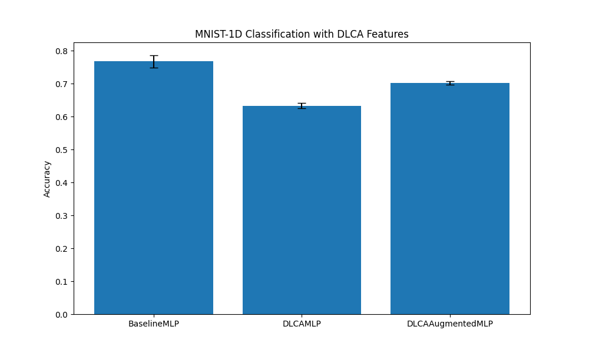

# Differentiable Level Crossing Analysis (DLCA)

This experiment investigates the use of Differentiable Level Crossing Analysis (DLCA) as a feature extraction layer for signal classification.

## Method

Level Crossing Analysis is a classical signal processing technique where one counts how many times a signal crosses a certain threshold (level). This can provide information about the signal's frequency and amplitude distribution.

In this experiment, we implement a differentiable version of level crossing counting using sigmoid functions to approximate the indicator function of a crossing:
- **Upward Crossing**: $x_t < L$ and $x_{t+1} > L$
- **Downward Crossing**: $x_t > L$ and $x_{t+1} < L$

The differentiable approximation for an upward crossing at level $L$ is:
$C_{up}(t, L) = \sigma(\beta(x_{t+1} - L)) \cdot \sigma(\beta(L - x_t))$

where $\beta$ is a temperature parameter controlling the sharpness of the approximation.

We use $N$ levels uniformly spaced across the signal range and compute total upward and downward crossings for each level as features.

## Experiment Setup

- **Dataset**: MNIST-1D (10,000 samples).
- **Models**:
    - `BaselineMLP`: A 2-layer MLP acting directly on the raw signal.
    - `DLCAMLP`: A 2-layer MLP acting only on the DLCA features (10 levels, 20 features).
    - `DLCAAugmentedMLP`: A 2-layer MLP acting on the concatenation of raw signal and DLCA features.
- **Hyperparameter Tuning**: Learning rate was tuned for each model using Optuna (20 trials).
- **Evaluation**: Mean and standard deviation of accuracy over 3 different seeds.

## Results

| Model | Accuracy (Mean +/- Std) | Best LR |
|-------|-------------------------|---------|
| BaselineMLP | 76.75% +/- 1.85% | 0.0084 |
| DLCAMLP | 63.30% +/- 0.76% | 0.0090 |
| DLCAAugmentedMLP | 70.20% +/- 0.54% | 0.0100 |

## Conclusion

In this experiment, the differentiable level crossing features did not improve performance over the raw signal baseline. In fact, adding the features (`DLCAAugmentedMLP`) resulted in lower performance than the baseline, and using only DLCA features (`DLCAMLP`) was significantly worse.

Possible reasons for this outcome:
1. **Loss of Information**: Level crossing counts are inherently summary statistics that discard phase and precise temporal information.
2. **Signal Length**: MNIST-1D signals are quite short (40 samples), which might not be enough to get stable crossing statistics.
3. **Approximation Artifacts**: The sigmoid approximation might introduce gradients that are difficult to optimize or biased compared to the true discrete counts.

Despite the negative result for this specific task, DLCA remains an interesting differentiable bridge between classical signal analysis and neural networks.
