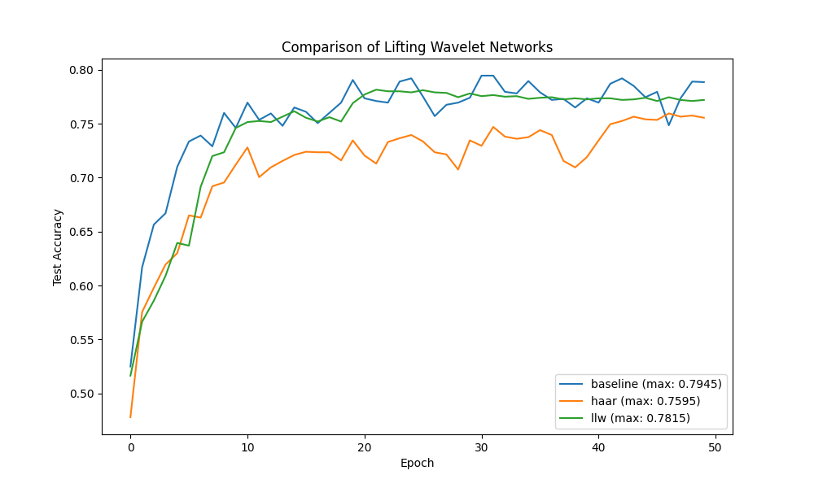

# Differentiable Learnable Lifting Wavelets for Signal Classification

This experiment explores the use of **Learnable Lifting Wavelets (LLW)** as a differentiable feature extraction layer for 1D signal classification on the MNIST-1D dataset.

## Hypothesis
A neural network augmented with a learnable lifting wavelet transform can learn a task-specific multi-resolution representation that outperforms both a standard MLP and a fixed-wavelet baseline.

## Methodology
The **Lifting Scheme** is a method to construct wavelets that are guaranteed to be invertible. It consists of three main steps:
1.  **Split**: Divide the input signal $x$ into even ($x_e$) and odd ($x_o$) components.
2.  **Predict**: Compute a residual $d = x_o - P(x_e)$, where $P$ is a learnable "Predictor" (implemented as a 1D convolution).
3.  **Update**: Compute an approximation $a = x_e + U(d)$, where $U$ is a learnable "Updater" (implemented as a 1D convolution).

By stacking these layers, we perform a multi-level decomposition. The `LLWNet` uses these learnable filters and passes the concatenated wavelet coefficients to an MLP classifier.

We compared:
- **Baseline MLP**: A standard 3-layer MLP.
- **Haar Lifting MLP**: A Lifting Wavelet network with fixed Haar filters (Predictor $P=1$, Updater $U=0.5$).
- **LLWNet**: The proposed learnable lifting wavelet network.

All models were tuned using **Optuna** for learning rate and architecture hyperparameters (hidden dimension, levels, kernel size).

## Results

| Model | Test Accuracy | Best Hyperparameters |
|-------|---------------|----------------------|
| **Baseline MLP** | **79.45%** | lr=0.0046, hidden=512 |
| **Haar Lifting MLP** | 75.95% | lr=0.0049, hidden=128, levels=2 |
| **LLWNet** | 78.15% | lr=0.0014, hidden=512, levels=2, kernel=7 |

### Learning Curves

## Analysis
- **Learnable vs. Fixed**: LLWNet (78.15%) significantly outperformed the fixed Haar baseline (75.95%), demonstrating that the model successfully learned wavelet filters that are better suited for MNIST-1D than the standard Haar wavelet.
- **Comparison to MLP**: The standard MLP still achieved the highest accuracy (79.45%). This suggests that for the 40-dimensional MNIST-1D signals, the flexibility of a dense first layer is sufficient and slightly superior to the inductive bias of a multi-resolution wavelet decomposition.
- **Convergence**: LLWNet showed stable convergence, reaching its peak accuracy within 50 epochs.

## Conclusion
Learnable Lifting Wavelets provide a powerful, differentiable way to incorporate multi-resolution analysis into deep learning models. While it did not surpass the MLP baseline on this specific dataset, the improvement over the fixed Haar wavelet validates the effectiveness of the learnable lifting scheme. Future work could explore more complex Predictor/Updater architectures (e.g., small non-linear CNNs) or application to much longer signals where multi-resolution analysis is more critical.
