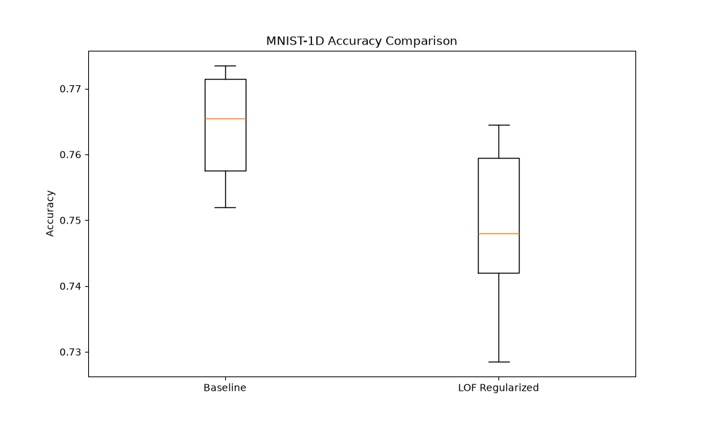

# Differentiable Local Outlier Factor (DLOF) Experiment

## Hypothesis
The Local Outlier Factor (LOF) is a classic unsupervised algorithm for anomaly detection that measures the local density deviation of a given data point with respect to its neighbors. We hypothesize that incorporating a **Differentiable Local Outlier Factor (DLOF)** loss as a regularizer in the latent space of a neural network can encourage the model to learn representations with more homogeneous local densities. This could potentially lead to better generalization by preventing the formation of isolated clusters or "outliers" in the embedding space during training.

## Methodology
The DLOF loss is implemented by computing a batch-wise distance matrix and using `torch.topk` to find the $k$-nearest neighbors for each sample in the batch. The reachability distance, local reachability density (lrd), and LOF are then calculated using differentiable operations. The loss is defined as the mean squared deviation of the LOF scores from 1.0:
$$ \mathcal{L}_{LOF} = \text{mean}((\text{LOF} - 1)^2) $$

We compared two architectures on the `mnist1d` dataset:
1.  **Baseline MLP**: A standard 2-layer MLP.
2.  **LOF-Regularized MLP**: The same MLP architecture, but with the DLOF loss applied to the output of the second hidden layer during training.

### Experimental Setup
- **Hyperparameter Tuning**: We used Optuna to tune the learning rate for both models (20 trials each). For the LOF-regularized model, we also tuned the regularization weight (`lof_weight`).
- **Evaluation**: Both models were evaluated using 5 different random seeds for 30 epochs using their best-found hyperparameters.
- **Dataset**: `mnist1d` with 10,000 samples.

## Results

| Model | Accuracy (Mean +/- Std) |
|-------|------------------------|
| Baseline MLP | 76.40% +/- 0.82% |
| LOF-Regularized MLP | 74.85% +/- 1.28% |

### Observations
- **Performance**: The `Baseline MLP` slightly outperformed the `LOF-Regularized MLP`. This suggests that for the `mnist1d` classification task, enforcing local density homogeneity in the latent space does not provide a discriminative advantage and may even slightly hinder the model's ability to learn class-specific features.
- **Sensitivity**: The LOF-regularized model showed slightly higher variance across seeds compared to the baseline.
- **Regularization Strength**: The best `lof_weight` found by Optuna was relatively small (around 0.034), indicating that a large DLOF penalty might be too restrictive for this task.

## Conclusion
The DLOF loss successfully provides a differentiable way to incorporate local density information into neural network training. While it did not improve performance on the `mnist1d` classification task, this approach might be more beneficial in scenarios where the latent space structure is more critical, such as in semi-supervised learning, open-set recognition, or anomaly detection tasks where the model needs to distinguish between in-distribution and out-of-distribution samples more effectively.
