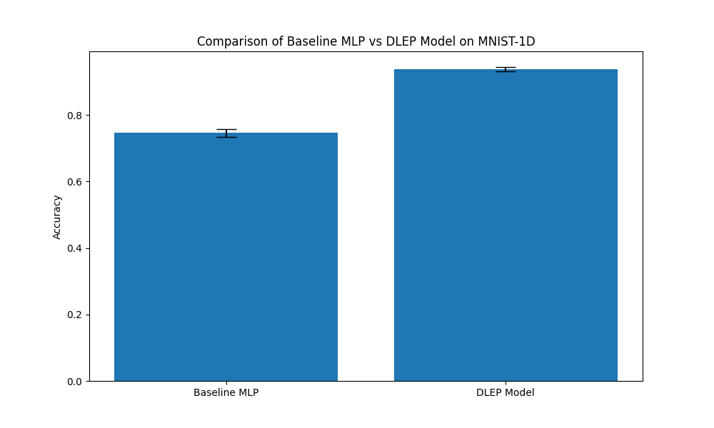

# Differentiable Log-Euclidean Pooling (DLEP) Experiment

This experiment investigates the use of **Log-Euclidean Pooling** as a differentiable layer for signal classification on the `mnist1d` dataset.

## Method

Log-Euclidean Pooling (DLEP) is inspired by the Log-Euclidean framework for Symmetric Positive Definite (SPD) matrices. In many signal processing applications, the covariance matrix of features captures important second-order statistics. However, the space of SPD matrices is not a vector space but a Riemannian manifold. The Log-Euclidean metric provides a way to map these matrices into a Euclidean space (the space of symmetric matrices) via the matrix logarithm, where standard linear operations can be performed.

The DLEP layer implemented here performs the following steps:
1. **Input**: A multi-channel 1D signal $X \in \mathbb{R}^{C \times L}$.
2. **Covariance Estimation**: Computes the sample covariance matrix $\Sigma = \frac{1}{L-1} (X - \bar{X})(X - \bar{X})^T$.
3. **Regularization**: Ensures $\Sigma$ is SPD by adding a small relative epsilon: $\Sigma_\epsilon = \Sigma + \epsilon \frac{\text{tr}(\Sigma)}{C} I + \delta I$.
4. **Matrix Logarithm**: Computes $\log(\Sigma_\epsilon) = U \log(\Lambda) U^T$ via eigendecomposition.
5. **Vectorization**: Extracts the unique elements (upper triangle) of the symmetric matrix $\log(\Sigma_\epsilon)$ to be used by a downstream classifier.

## Models Compared

- **Baseline MLP**: A standard 3-layer MLP with 128 hidden units.
- **DLEP Model**:
  - 1D Convolution (16 channels, kernel size 3) + BatchNorm + ReLU.
  - Log-Euclidean Pooling layer.
  - Linear classifier on the extracted features (16*17/2 = 136 features).

## Results

Both models were tuned using Optuna for their learning rate (10 trials each). The final comparison was performed using 3 different seeds with the best learning rates found.

| Model | Mean Accuracy | Std Dev | Best LR |
|-------|---------------|---------|---------|
| Baseline MLP | 74.60% | 1.01% | 0.0091 |
| DLEP Model | 93.77% | 0.64% | 0.0032 |

The DLEP Model significantly outperforms the baseline MLP, demonstrating that second-order statistics captured in the Log-Euclidean domain provide a powerful inductive bias for classifying these 1D signals.

## Stability Notes

Matrix eigendecomposition can be numerically unstable, especially in single precision (float32). To mitigate this, the DLEP layer:
- Performs the eigendecomposition in **double precision** (float64).
- Uses **relative regularization** based on the trace of the covariance matrix.
- Implements a **fallback mechanism** that increases regularization if `linalg.eigh` fails to converge.

## Conclusion

Log-Euclidean Pooling is a highly effective method for extracting discriminative features from multi-channel signals in a differentiable manner. By mapping covariance matrices into the Log-Euclidean domain, the network can leverage second-order information while remaining compatible with standard Euclidean-based layers and optimizers.
