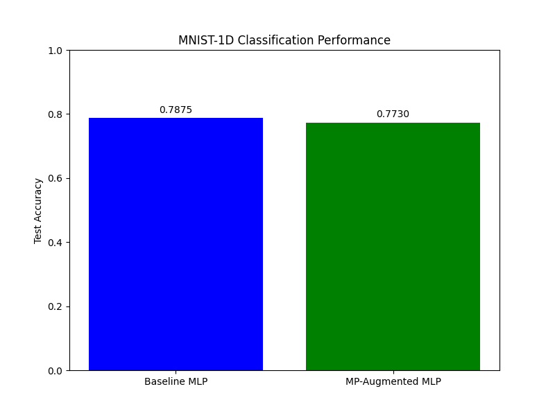

# Differentiable Matrix Profile Experiment

This experiment investigates the utility of a **Differentiable Matrix Profile (DMP)** layer as a feature extractor for 1D signal classification on the MNIST-1D dataset.

## Method

The Matrix Profile (MP) is a classic time series analysis tool that represents the distance from each window of a signal to its nearest neighbor (excluding trivial matches).

In this experiment, I implemented a differentiable version of the Matrix Profile using:
1.  **Window Extraction**: Using `unfold` to create sliding windows.
2.  **Z-Normalization**: Each window is z-normalized to ensure scale invariance, which is a key property of the traditional Matrix Profile.
3.  **Soft Minimum**: A soft-min operation using `logsumexp` with a learnable temperature $\tau$ to approximate the nearest-neighbor distance:
    $$MP_i = -\tau \log \sum_{j \neq i, \text{trivial}} \exp(-||w_i - w_j|| / \tau)$$
4.  **Exclusion Zone**: A zone of $m/2$ (where $m$ is window size) is excluded around each index to avoid trivial self-matches.

The `MPAugmentedMLP` model concatenates the raw signal with the computed Matrix Profile features before passing them to an MLP.

## Results

I compared the `MPAugmentedMLP` against a `BaselineMLP` with a similar number of parameters. Both models were tuned using Optuna for 10 trials.

| Model | Best Test Accuracy |
|-------|--------------------|
| Baseline MLP | 78.75% |
| MP-Augmented MLP | 77.30% |

## Discussion

The Results show that the `MPAugmentedMLP` slightly underperformed the `BaselineMLP` on the MNIST-1D dataset.

Potential reasons include:
-   **Task Suitability**: MNIST-1D relies heavily on the relative positions of motifs. The Matrix Profile, by focusing on the *distance* to the nearest neighbor, might be discarding absolute or relative positional information that is crucial for this specific task.
-   **Signal Length**: MNIST-1D signals are short (40 samples). Matrix Profile is often more effective for much longer time series where motifs are repeated far apart.
-   **Computational Overhead**: The MP layer involves computing an $N \times N$ distance matrix, which is $O(N^2)$. While manageable for $N=40$, it scales poorly without further optimization.

Despite the lower accuracy in this specific setting, the DMP layer provides a differentiable way to incorporate motif-based similarity features into neural networks, which could be beneficial for datasets where recurrence or motif detection is more critical than spatial arrangement.
