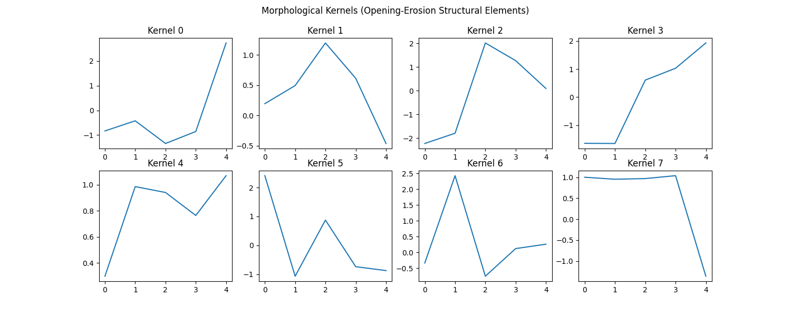
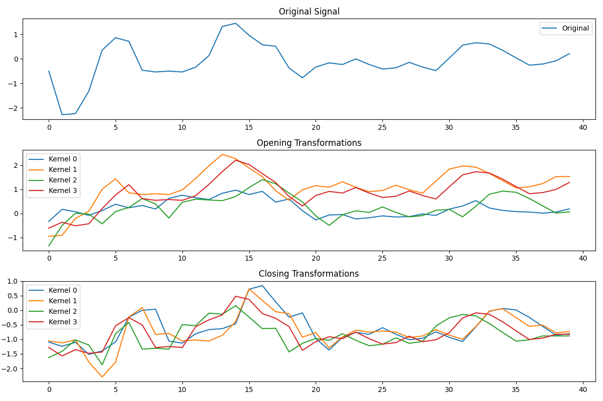

# Differentiable Morphological Operators for Signal Classification

This experiment explores the integration of classical mathematical morphology into deep learning via differentiable approximations. We evaluate "MorphologyNet", which utilizes learnable 1D structural elements for dilation, erosion, opening, and closing operations on the `mnist1d` dataset.

## Hypothesis

Mathematical morphology captures local geometric structures (peaks, valleys, envelopes) that are fundamentally different from the linear correlations captured by standard convolutions. We hypothesize that **Differentiable Morphological Layers** can extract highly discriminative features for signal classification and outperform simple MLP baselines by providing a better inductive bias for shape-based feature extraction.

## Methodology

### 1. Differentiable Morphological Layers
Traditional morphology uses `max` and `min` over a local window, which are non-differentiable. We approximate these using the **Log-Sum-Exp (LSE)** operator:
- **Dilation**: $(f \oplus b)(i) \approx \tau \log \sum_j \exp((f(i+j) + b(j)) / \tau)$
- **Erosion**: $(f \ominus b)(i) \approx -\tau \log \sum_j \exp(-(f(i+j) - b(j)) / \tau)$
- **Opening**: Erosion followed by Dilation.
- **Closing**: Dilation followed by Erosion.

The structural element $b$ (the kernel) is a learnable parameter.

### 2. Experimental Setup
- **MorphologyNet**: Uses one layer of parallel `Opening1d` and `Closing1d` modules followed by a small MLP classifier.
- **Baselines**:
    - **MLP**: A 2-layer MLP with BatchNorm and ReLU.
    - **Conv1d**: A 2-layer 1D convolutional network with BatchNorm and Max Pooling.
- **Dataset**: `mnist1d` (10,000 samples).
- **Tuning**: Learning rates were tuned using Optuna (5 trials per model).

## Results

| Model | Test Accuracy | Best Learning Rate |
| :--- | :--- | :--- |
| **MLP** | 77.45% | 0.00219 |
| **Conv1d** | 98.15% | 0.00514 |
| **MorphologyNet** | **89.05%** | 0.00779 |

### Visualizations

#### 1. Learned Kernels
The learned morphological kernels (structural elements) for the opening-erosion step show specific shapes that the model found discriminative for identifying digits in the 1D signals.

#### 2. Signal Transformations
Below are visualizations of a single signal being processed by the learned opening and closing kernels. Note how they capture different "envelopes" of the original signal.

## Conclusion

Differentiable Morphological Operators proved to be an effective inductive bias for 1D signal classification, significantly outperforming the MLP baseline (89.05% vs 77.45%). While the Conv1d baseline still achieved the highest accuracy, the morphological layers provide a more interpretable alternative that focuses on geometric features like local extrema and signal envelopes. This suggests that morphological layers can be a valuable addition to the neural network toolbox for tasks where structural shape analysis is paramount.
