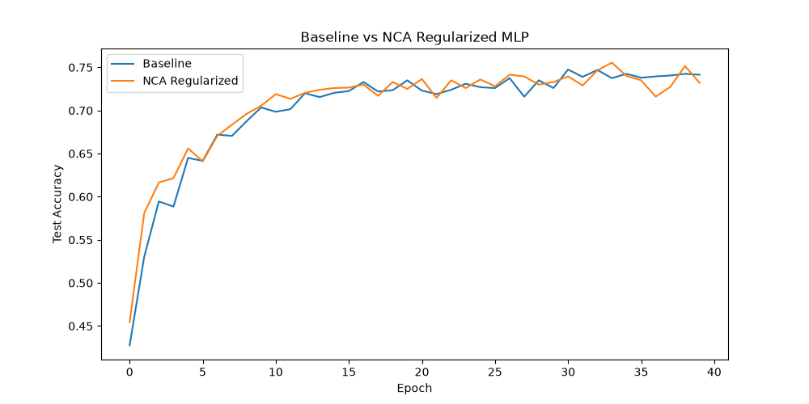

# Differentiable Neighborhood Components Analysis (NCA) Regularization Experiment

## Hypothesis
Neighborhood Components Analysis (NCA) is a distance-based metric learning algorithm that learns a projection to maximize the leave-one-out classification performance in the projected space. We hypothesize that using NCA as a differentiable regularization term on the penultimate layer of a neural network can improve classification performance by encouraging better class separation in the latent space.

## Methodology
- **NCA Loss**: Implemented as a differentiable loss function that computes the probability of each sample being correctly classified by its neighbors in the embedding space using a softmax over negative squared Euclidean distances.
- **NCA Regularized MLP**: A 3-layer MLP where the penultimate layer's output is regularized with the NCA loss.
- **Baseline MLP**: A standard 3-layer MLP with a similar architecture.
- **Dataset**: `mnist1d` (10,000 samples).
- **Hyperparameter Tuning**: Both models were tuned independently using Optuna (10-15 trials each) to find the optimal learning rate and, for NCA, the regularization weight and temperature.
- **Evaluation**: The best configurations were evaluated over 3 random seeds for 40 epochs each.

## Results
The experiment compared the Baseline MLP and the NCA-regularized MLP on the MNIST-1D task.

| Model | Test Accuracy (Mean +/- Std) |
| :--- | :--- |
| **Baseline MLP** | **73.88% +/- 0.76%** |
| **NCA Regularized MLP** | **73.60% +/- 0.79%** |

### Parameters
- **Baseline**: `lr: 0.00305`
- **NCA**: `lr: 0.00824`, `nca_weight: 0.0321`, `nca_temp: 3.006`

### Accuracy Plot

## Conclusion
The Differentiable NCA regularization did not provide a significant performance advantage over the baseline MLP on the MNIST-1D dataset. The accuracies are very similar, within one standard deviation of each other. This suggests that while NCA encourages class separation in the latent space, the standard Cross-Entropy loss might already be sufficient for learning discriminative features on this particular task, or that the NCA regularization requires more careful tuning or a different architecture to be effective.
