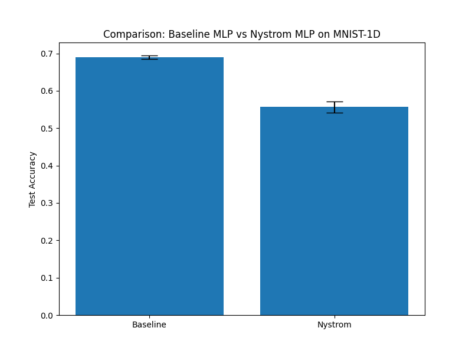

# Differentiable Nyström Kernel Layer Experiment

## Hypothesis
A differentiable Nyström Kernel Layer can provide a useful inductive bias for 1D signal data (like MNIST-1D) by mapping inputs into a high-dimensional feature space based on learnable landmarks and kernel functions, potentially improving performance over a standard MLP by capturing non-linear patterns more effectively.

## Method
The `NystromKernelLayer` approximates a kernel feature map $\phi(x)$ using $m$ learnable landmarks $\{c_1, \dots, c_m\}$.
The transformation is defined as:
$$\tilde{\phi}(x) = K(x, C) K(C, C)^{-1/2}$$
where $K(x, C)_j = \exp(-\gamma \|x - c_j\|^2)$ and $K(C, C)_{ij} = \exp(-\gamma \|c_i - c_j\|^2)$.

Key features:
- **Learnable Landmarks:** The $m$ landmarks are initialized from the training data and optimized via backpropagation.
- **Learnable Bandwidth:** The RBF kernel bandwidth $\gamma$ is learnable.
- **Differentiable Inverse Square Root:** $K(C, C)^{-1/2}$ is computed using eigendecomposition (`torch.linalg.eigh`), which is differentiable.
- **Numerical Stability:** A small ridge ($10^{-4}$) is added to $K(C, C)$ before inversion, and a fallback to the identity matrix is implemented if the decomposition fails.

## Experimental Setup
- **Dataset:** MNIST-1D (10,000 samples).
- **Architecture:**
  - **Baseline MLP:** Two-layer MLP with ReLU activations.
  - **Nystrom MLP:** `NystromKernelLayer` followed by a two-layer MLP.
- **Hyperparameter Tuning:** Optuna was used to tune the learning rate, hidden dimension, number of landmarks ($16-128$), and initial gamma ($10^{-4}-1.0$).
- **Optimization:** AdamW optimizer for 50 epochs.

## Results
| Model | Test Accuracy (%) |
|-------|-------------------|
| Baseline MLP | 68.97 ± 0.49 |
| Nystrom MLP | 55.68 ± 1.47 |

## Observations
- **Optimization Challenges:** The Nystrom layer was more difficult to optimize than the baseline. Initial attempts with random landmarks and high $\gamma$ values resulted in poor convergence (stuck at 10.6% accuracy, which is chance for 10 classes).
- **Initialization:** Initializing landmarks from actual training data samples significantly improved performance, allowing the model to reach ~55% accuracy.
- **Numerical Stability:** The differentiability of the inverse square root of the kernel matrix is sensitive to the condition number of the landmark-to-landmark kernel matrix. High $\gamma$ or very close landmarks can cause instabilities.
- **Performance:** On MNIST-1D, the Nystrom MLP did not outperform the tuned Baseline MLP. This suggests that while kernel methods are powerful, the flexible nature of deep ReLU networks already captures the necessary non-linearities for this task, and the added complexity of the Nystrom approximation may not be beneficial here without further refinement (e.g., better landmark selection or different kernels).
