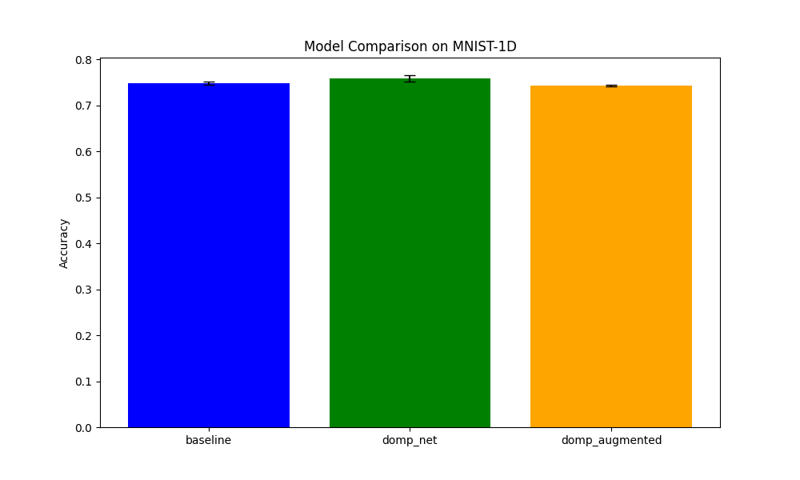

# Differentiable Matching Pursuit (DOMP) Experiment

This experiment introduces a differentiable version of the Matching Pursuit (MP) algorithm, called `DOMPLayer`. It uses a soft selection mechanism to make the traditionally greedy and non-differentiable MP algorithm suitable for training with backpropagation.

## Methodology

### DOMPLayer
The `DOMPLayer` implements a "soft" Matching Pursuit. In each iteration:
1. It computes the correlation between the current residual and all atoms in a learnable dictionary.
2. It applies a softmax over the absolute correlations (multiplied by a temperature parameter `beta`) to obtain selection weights.
3. It updates the sparse coefficients by adding the correlation values weighted by these soft selection weights.
4. It updates the residual by subtracting the reconstruction (coefficients times dictionary atoms) from the original input.

The dictionary atoms are normalized to unit $L^2$ norm. The temperature parameter `beta` is also learnable.

### Models
Three models were compared:
1. **BaselineMLP**: A standard 2-layer MLP.
2. **DOMPNet**: A model that passes the input through a `DOMPLayer` to get sparse coefficients, followed by a linear classifier.
3. **DOMPAugmentedMLP**: A model that concatenates the raw input with the `DOMPLayer` coefficients before passing them through an MLP.

### Evaluation
The models were evaluated on the MNIST-1D dataset. For each model, the learning rate was tuned using Optuna (10 trials). The best learning rate was then used to train the model 3 times to compute the mean and standard deviation of the accuracy.

## Results

| Model | Accuracy (Mean ± Std) | Best LR |
|-------|-----------------------|---------|
| BaselineMLP | 74.87% ± 0.35% | 0.00436 |
| DOMPNet | 75.93% ± 0.67% | 0.00814 |
| DOMPAugmentedMLP | 74.35% ± 0.12% | 0.00380 |

The `DOMPNet` achieved a slightly higher accuracy than the baseline MLP, suggesting that the sparse representation learned by the differentiable Matching Pursuit layer can be beneficial for classification. The `DOMPAugmentedMLP` did not show improvement over the baseline in this particular setup.

## Conclusion
Differentiable Matching Pursuit provides a way to incorporate sparse coding principles into neural networks while remaining end-to-end trainable. In this experiment, it showed a modest improvement over a baseline MLP on the MNIST-1D task.
