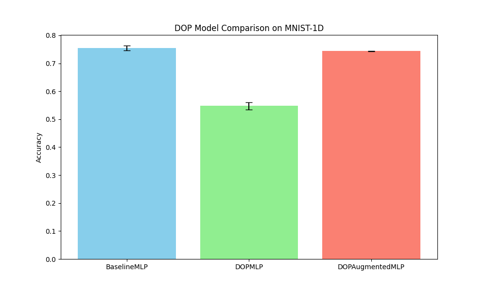

# Differentiable Ordinal Patterns (DOP) Experiment

## Hypothesis
Ordinal patterns (the relative ordering of values in a local window) are a powerful tool in time-series analysis for capturing local dynamics while being invariant to monotonic distortions (scaling, shifting). Standard ordinal pattern extraction is non-differentiable. We hypothesize that a **Differentiable Ordinal Patterns (DOP)** layer, which uses a sigmoid-based soft-ranking mechanism, can allow neural networks to learn task-specific local ordinal features end-to-end.

## Methodology
The DOP layer extracts windows of size $d$ with delay $\tau$ from a 1D signal. Within each window, it computes all-pairs soft comparisons:
$$ y_{i,j} = \sigma(\text{temp} \cdot (x_i - x_j)) $$
where $\sigma$ is the sigmoid function and $\text{temp}$ is a learnable temperature. For a window of size $d$, there are $d(d-1)/2$ such pairs.

We compared three architectures on the `mnist1d` dataset:
1.  **Baseline MLP**: A 2-layer MLP on raw features.
2.  **DOPMLP**: An MLP that takes only the flattened DOP features as input ($d=3, \tau=1$).
3.  **DOPAugmentedMLP**: An MLP that takes the concatenation of raw features and DOP features.

Learning rates were tuned for each model using Optuna (5 trials). Final evaluation was performed with 2 different seeds for 30 epochs.

## Results

| Model | Accuracy (Mean +/- Std) |
|-------|------------------------|
| Baseline MLP | 75.50% +/- 0.85% |
| DOPMLP | 54.77% +/- 1.33% |
| DOPAugmentedMLP | 74.38% +/- 0.02% |

### Observations
- **Information Loss**: The `DOPMLP` performed significantly worse than the baseline, suggesting that while ordinal patterns capture important qualitative dynamics, the absolute values and precise quantitative differences discarded by the (near) rank-based transform are crucial for the `mnist1d` classification task.
- **Redundancy/Optimization**: `DOPAugmentedMLP` did not improve upon the baseline. The added DOP features might be redundant or could be making the optimization landscape more difficult, as evidenced by the slightly lower mean performance compared to the baseline.
- **Invariance vs. Discriminative Power**: While DOP provides invariance to monotonic shifts, the `mnist1d` dataset (which involves localized digits with varying positions and noise) might require the precise spatial and amplitude information that standard MLP layers are better at extracting.

## Conclusion
The Differentiable Ordinal Patterns layer successfully implements a soft-ranking mechanism that is end-to-end trainable. However, for the `mnist1d` dataset, these ordinal features do not provide an advantage over raw features and may even lead to information loss when used in isolation. Future experiments could test this layer on datasets where monotonic invariance is more critical, such as physiological signals (EEG/ECG) or financial time series with varying scales.
