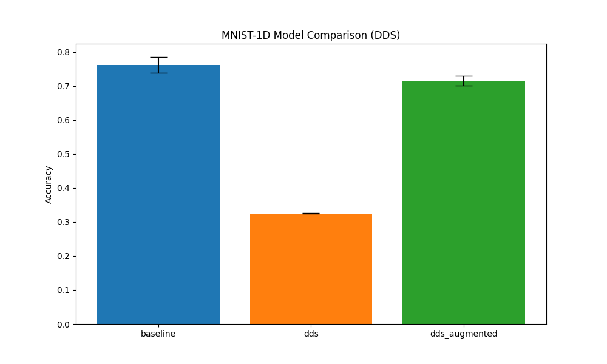

# Differentiable Delay Signature (DDS) Experiment

This experiment introduces a **Differentiable Delay Signature (DDS)** layer that combines **Delay Embedding** with **Path Signatures** for signal classification.

## Hypothesis

By lifting a 1D signal into a higher-dimensional space using a learnable delay $\tau$ (delay embedding) and then computing the path signature of the resulting trajectory, we can extract geometric invariants that are robust to time-reparameterization and capture complex multi-scale dynamics of the signal. Making this entire pipeline differentiable allows the model to optimize the embedding time scale $\tau$ and the subsequent signature-based feature extraction.

## Methodology

### 1. Delay Embedding
The 1D signal $x(t)$ is lifted to a $D$-dimensional path $X(t) = (x(t), x(t-\tau), \dots, x(t-(D-1)\tau))$. We use linear interpolation to allow for fractional, learnable values of $\tau$.

### 2. Path Signature
The signature of a path $X: [0, T] \to \mathbb{R}^D$ is a sequence of iterated integrals:
$$ S(X)_{i_1, \dots, i_k} = \int_{0 < t_1 < \dots < t_k < T} dX_{t_1}^{i_1} \dots dX_{t_k}^{i_k} $$
We implement a differentiable version for piecewise linear paths up to depth $k=2$. For $D=3$ and $k=2$, this results in $3 + 9 = 12$ features.

### 3. Models
- **Baseline MLP**: A standard 3-layer MLP on raw 40-dimensional signals.
- **DDSRNet**: An MLP that only uses the 12 signature features from the learned delay embedding.
- **DDSAugmentedMLP**: An MLP that combines the raw signal with the 12 signature features.

## Results

The models were tuned using Optuna (10 trials) and evaluated over 3 independent seeds for 30 epochs.

| Model | Accuracy (Mean ± Std) |
|---|---|
| **Baseline MLP** | 76.23% ± 2.33% |
| **DDSRNet** | 32.58% ± 0.13% |
| **DDS-Augmented MLP** | 71.62% ± 1.41% |

## Observations
- **Low Performance of Standalone Signature**: The `DDSRNet` performed significantly worse than the baseline, despite performing better than random (10%). This indicates that the first and second-order iterated integrals of the delay-embedded signal, while containing some structural information, discard too much quantitative or local information necessary for the MNIST-1D task.
- **Degradation in Augmented Model**: The `DDS-Augmented MLP` also performed worse than the baseline. This suggests that the additional 12 signature features might be introducing noise or making the optimization landscape more difficult without providing sufficiently novel discriminative information to compensate.
- **Task Fit**: Path signatures are particularly known for their invariance to time-reparameterization. If the MNIST-1D dataset's discriminative features rely heavily on precise timing or local shape rather than global geometric invariants of the phase-space trajectory, this method might not be the most suitable.

## Conclusion
While the Differentiable Delay Signature layer successfully integrates delay embedding and path signatures into a trainable neural network, it did not provide a performance advantage for the MNIST-1D classification task. Future work could explore higher signature depths ($k > 2$) or apply this method to tasks where time-reparameterization invariance is more critical, such as gesture recognition or financial anomaly detection.
