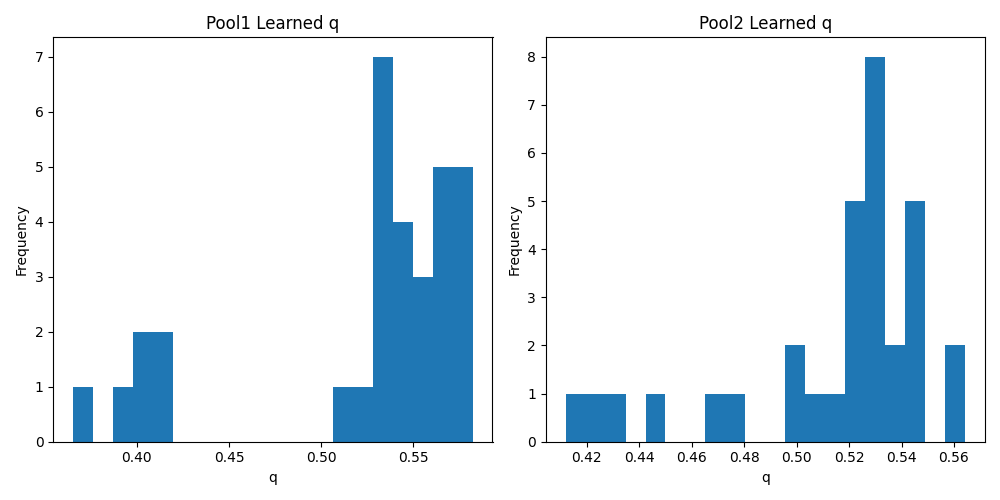

# Experiment Results: Implicit Differentiable Quantile Pooling

| Pool Type | Accuracy | Best LR |
|-----------|----------|---------|
| max | 0.9575 +- 0.0095 | 0.005691 |
| avg | 0.9420 +- 0.0050 | 0.005897 |
| median | 0.9110 +- 0.0130 | 0.009708 |
| lp | 0.9510 +- 0.0005 | 0.008755 |
| quantile | 0.9612 +- 0.0003 | 0.008674 |

## Analysis of Learned Quantiles

Average q in Pool1: 0.5387
Average q in Pool2: 0.5089

## Analysis of Learned Quantiles

Average q in Pool1: 0.5230
Average q in Pool2: 0.5152

