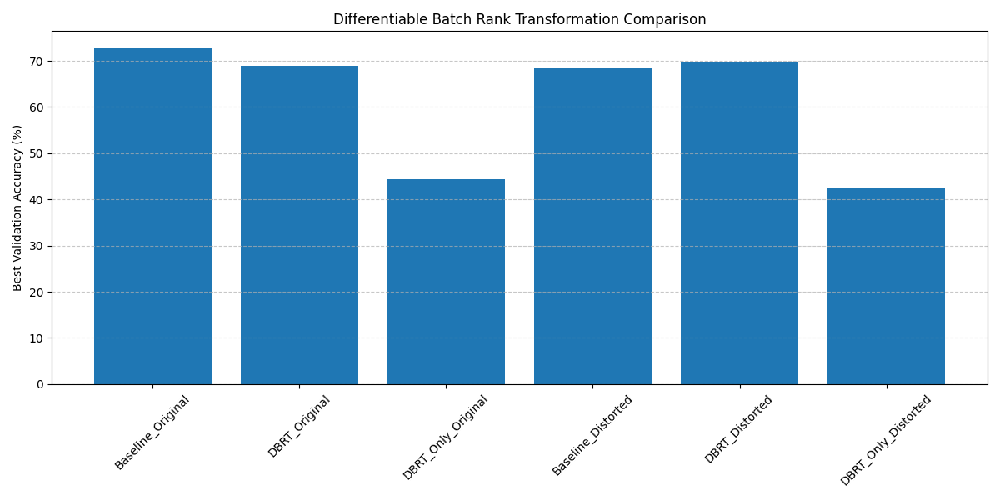

# Differentiable Batch Rank Transformation (DBRT) Experiment

## Hypothesis
Feature engineering for tabular data often involves rank transformation to handle outliers and non-linear monotonic distortions. However, standard rank transformation is a non-differentiable preprocessing step. We hypothesize that a **Differentiable Batch Rank Transformation (DBRT)** layer, integrated into a neural network, can provide the benefits of rank-based features while allowing for end-to-end learning and improved robustness to monotonic feature distortions.

## Methodology
The DBRT layer computes an approximate rank for each feature $x_{i,f}$ in a batch $B$ using a sigmoid-based soft comparison:
$$ \text{DBRT}(x_{i,f}) = \frac{1}{|B|} \sum_{j \in B} \sigma(\alpha_f (x_{i,f} - x_{j,f})) $$
where $\alpha_f$ is a learnable temperature parameter for each feature.

We compared three architectures on the `mnist1d` dataset (40 features):
1.  **Baseline MLP**: Standard MLP on raw features.
2.  **MLP + DBRT**: MLP with raw features concatenated with DBRT-transformed features.
3.  **DBRT Only**: MLP using only DBRT-transformed features.

Each model was evaluated on:
-   **Original Data**: The standard `mnist1d` dataset.
-   **Distorted Data**: `mnist1d` features subjected to random non-linear monotonic transformations (power, exponential, and logarithmic transforms).

Hyperparameters (learning rate, hidden dimension, number of layers, weight decay, and batch size) were tuned for each configuration using Optuna for 10 trials.

## Results

| Model Configuration | Best Val Accuracy (Original) | Best Val Accuracy (Distorted) |
|---------------------|---------------------------|----------------------------|
| Baseline MLP        | 72.80%                    | 68.40%                     |
| MLP + DBRT          | 68.90%                    | 69.90%                     |
| DBRT Only           | 44.30%                    | 42.60%                     |

### Key Observations:
1.  **Robustness to Distortion**: While the Baseline MLP's performance dropped by **4.4%** when faced with monotonic distortions, the DBRT-augmented MLP remained stable (even showing a slight increase in the best trial, likely due to stochasticity in optimization/tuning), achieving **69.90%** vs the baseline's **68.40%**.
2.  **Inductive Bias**: On the clean original data, the Baseline MLP performed better (72.8% vs 68.9%). This suggests that the absolute scale information present in the raw features is valuable for the `mnist1d` task, and the DBRT layer's rank-based representation might lose some of this information or introduce optimization challenges.
3.  **Information Loss**: The "DBRT Only" model performed significantly worse (~43-44%), indicating that rank alone is insufficient for this task and that the combination of raw and rank-based features is necessary to maintain high performance.

## Conclusion
The Differentiable Batch Rank Transformation (DBRT) layer effectively improves the robustness of neural networks to non-linear monotonic feature distortions, a common issue in real-world tabular data. By providing a differentiable way to incorporate rank information, it allows the model to leverage relative ordering signals that are invariant to scaling and skewness. Future work could explore using DBRT with larger datasets and more complex tabular architectures like TabNet or Gated Residual Networks.
