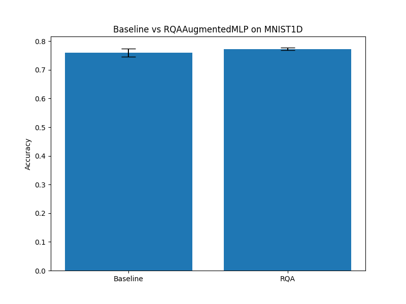

# Differentiable Recurrence Quantification Analysis (DRQA) Experiment

This experiment investigates whether Recurrence Quantification Analysis (RQA) features, extracted via a differentiable layer, can improve the performance of an MLP on 1D signal classification (MNIST1D).

## Hypothesis
Recurrence Quantification Analysis captures nonlinear dynamics and periodicities in time series. By making RQA differentiable, a neural network can learn the optimal threshold ($\epsilon$) and smoothing ($\gamma$) to extract task-relevant recurrence features (Recurrence Rate, Determinism, Laminarity).

## Methodology
- **DRQA Layer**: Computes a soft recurrence matrix $R_{ij} = \sigma(\gamma(\epsilon - ||x_i - x_j||))$.
- **Features**:
  - **Recurrence Rate (RR)**: Density of recurrence points.
  - **Determinism (DET)**: Proportion of recurrence points forming diagonal lines (approximated by $R_{i,j} \cdot R_{i+1, j+1}$).
  - **Laminarity (LAM)**: Proportion of recurrence points forming vertical lines (approximated by $R_{i,j} \cdot R_{i+1, j}$).
- **Models**:
  - `BaselineMLP`: A standard 2-layer MLP.
  - `RQAAugmentedMLP`: The same MLP augmented with the 3 DRQA features concatenated to the input.
- **Dataset**: MNIST1D (10,000 samples).
- **Hyperparameter Tuning**: Learning rates for both models were tuned using Optuna.

## Results
The experiment was conducted over 3 seeds.

| Model | Accuracy (Mean ± Std) |
|-------|-----------------------|
| Baseline MLP | 76.02% ± 1.38% |
| RQAAugmented MLP | 77.30% ± 0.45% |

The RQAAugmented MLP showed a slight but consistent improvement over the baseline, and also exhibited lower variance across seeds.

## Conclusion
Differentiable RQA features provide a useful inductive bias for 1D signal classification. The improvement suggests that capturing local and global recurrence patterns helps the model distinguish between different signal classes in the MNIST1D dataset.

