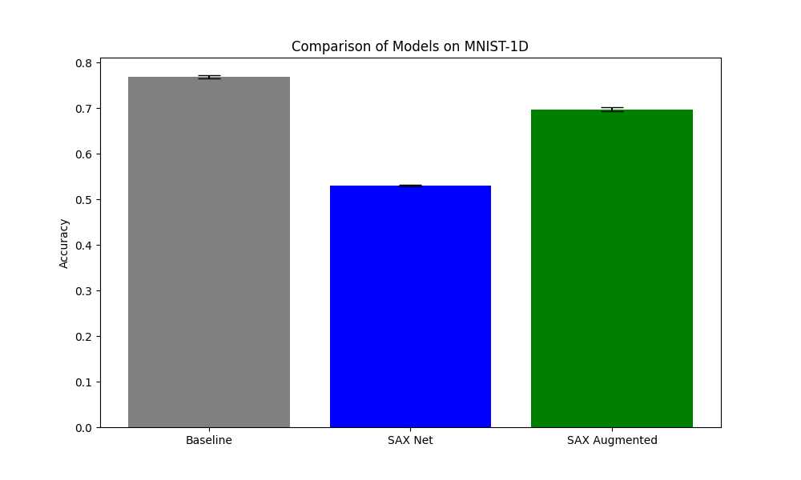

# Differentiable Symbolic Aggregate approXimation (SAX) Experiment

This experiment investigates a differentiable version of Symbolic Aggregate approXimation (SAX) for time series classification on the MNIST-1D dataset.

## Method

SAX is a classic method for time series representation that involves:
1. **Z-normalization**: Normalizing the series to zero mean and unit variance.
2. **Piecewise Aggregate Approximation (PAA)**: Reducing the dimensionality by averaging values in segments.
3. **Quantization**: Mapping the PAA values to discrete symbols based on Gaussian breakpoints.

In this implementation, we make SAX differentiable by using **soft quantization**. Instead of hard binning, we use sigmoids to compute membership probabilities for each bin. This allows gradients to flow back to the input signal and even to the breakpoints themselves.

## Models

- **BaselineMLP**: A standard MLP acting on raw input signals.
- **SAXNet**: An MLP that only uses the soft SAX features (concatenated bin probabilities for all segments).
- **SAXAugmentedMLP**: An MLP that uses both raw signals and SAX features as input.

## Results

The models were tuned using Optuna (10 trials each) and evaluated over 3 different seeds.

| Model | Accuracy (%) |
|-------|--------------|
| Baseline | 76.85 +/- 0.36 |
| SAX Net | 53.05 +/- 0.20 |
| SAX Augmented | 69.75 +/- 0.45 |

## Conclusion

The results show that SAX features alone (SAX Net) provide significant discriminative information (reaching >50% accuracy), but they are not as effective as the raw signal for the MNIST-1D task. Interestingly, augmenting the raw signal with SAX features (SAX Augmented) actually decreased performance compared to the baseline in this configuration, possibly due to increased model complexity or redundancy that the training process didn't handle optimally within the given trials.

The differentiability of the SAX layer was verified, allowing it to be used as a component in larger neural architectures where symbolic representation of time series might be beneficial.
