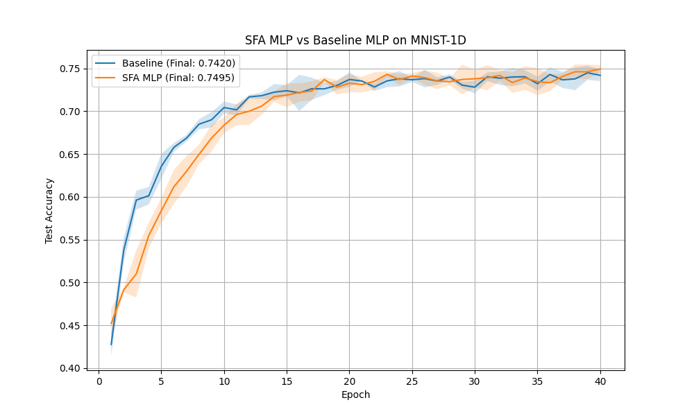

# Differentiable Slow Feature Analysis (SFA) Experiment

## Hypothesis
Slow Feature Analysis (SFA) is a technique for extracting invariant features from quickly varying input signals by finding functions that minimize the variance of their first-order temporal/spatial differences. We hypothesize that a "Soft-SFA" layer, which applies a 1D convolution and adds a slowness regularization penalty to the loss, can help a neural network learn more stable and discriminative features for signal classification tasks like `mnist1d`.

## Methodology
- **Soft-SFA Layer**: Extracts features using a 1D convolution. It computes a slowness penalty $L_{SFA} = \lambda \frac{\text{var}(\Delta y)}{\text{var}(y) + \epsilon}$, where $\Delta y$ is the difference between adjacent spatial points in the extracted feature maps.
- **SFA MLP**: Uses a `Soft-SFA Layer` followed by a standard MLP.
- **Baseline MLP**: A standard MLP with a comparable number of layers and hidden units.
- **Dataset**: `mnist1d` (10,000 samples).
- **Hyperparameter Tuning**: Learning rates for both models and the slowness regularization strength $\lambda$ were tuned using Optuna (10 trials each).
- **Evaluation**: The best configurations were evaluated over 3 random seeds for 40 epochs each.

## Results
The experiment showed that adding the SFA regularization slightly improved the performance and stability of the model.

| Model | Best Learning Rate | SFA Lambda | Test Accuracy (Mean +/- Std) |
| :--- | :--- | :--- | :--- |
| **Baseline MLP** | 0.00765 | N/A | 74.20% +/- 0.67% |
| **SFA MLP** | 0.00211 | 0.00363 | **74.95% +/- 0.43%** |

### Accuracy Plot

## Conclusion
The Differentiable SFA regularization proved beneficial for the `mnist1d` signal classification task. By encouraging the extracted features to vary smoothly across the spatial dimension, the model likely learned to ignore high-frequency noise and focus on the more stable, class-discriminative parts of the signal. The improvement in both mean accuracy and reduction in variance (standard deviation) suggests that SFA is a useful inductive bias for this type of data.
