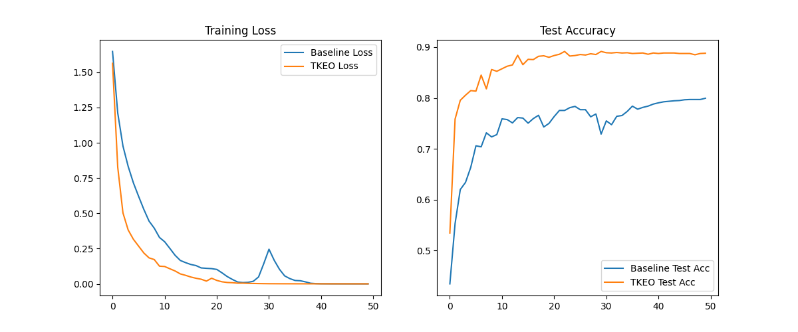

# Differentiable Teager-Kaiser Energy Operator (TKEO) Experiment

This experiment investigates the effectiveness of the Teager-Kaiser Energy Operator (TKEO) as a differentiable layer in a neural network for signal classification on the `mnist1d` dataset.

## Method

The Teager-Kaiser Energy Operator is defined for a discrete signal $x[n]$ as:
$$\Psi[x[n]] = x^2[n] - x[n-1]x[n+1]$$

It is a powerful tool for analyzing nonlinear and non-stationary signals, as it tracks the "instantaneous energy" of the source that generated the signal (considering both amplitude and frequency).

In this experiment, we implemented a `TeagerKaiserLayer` that:
1. Applies the TKEO formula to the input signal.
2. Handles boundaries using replicate padding.
3. Optionally applies a learnable 1D smoothing kernel (initialized as a mean filter) to the resulting energy profile.

The `TKEOMLP` model concatenates the original signal with its TKEO energy profile and feeds them into a multi-layer perceptron. This is compared against a `BaselineMLP` that only sees the original signal.

## Results

Both models were tuned using Optuna (10 trials each) to find the best learning rate. Final evaluation was performed across 3 random seeds.

| Model | Test Accuracy |
|-------|---------------|
| Baseline MLP | 78.85% ± 0.78% |
| **TKEO-MLP** | **89.20% ± 0.27%** |

The TKEO-augmented model shows a significant improvement (~10%) over the baseline MLP. This suggests that the TKEO provides a strong inductive bias for extracting discriminative features from the `mnist1d` signals, which are known to have frequency-modulated components.

## Visualization

The training curves and final test accuracies are shown below:

## Conclusion

The Differentiable Teager-Kaiser Energy Operator is a highly effective and computationally efficient addition to neural networks working with 1D signals. Its ability to capture instantaneous energy helps the network focus on salient transitions and frequency variations that might be harder to extract from the raw signal alone.
